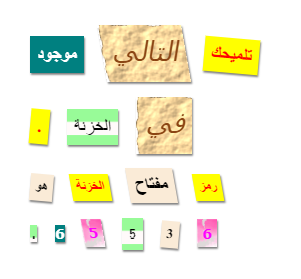

## المقدمة

في هذا المشروع، ستنشئ رسالة غامضة تبدو وكأن كل كلمة فيها قُصَّت من جريدة أو صحيفة أو مجلة هزلية مختلفة أو أي مصدر آخر. 

### معلومات إضافية لقادة النادي

إذا كنت بحاجة إلى طباعة هذا المشروع، فيُرجى استخدام [نسخة سهلة الطباعة](https://projects.raspberrypi.org/en/projects/mystery-letter/print).

--- collapse ---
---
title: ملاحظات قادة النادي
---

## المقدمة:
في هذا المشروع، سيتعرف الأطفال على فئات CSS. حيث سيستخدمون العديد من فئات CSS لتحديد نمط النص، كما سيتعلمون كيفية استخدام صور الخلفية وخطوط Google المجانية في مشاريعهم. 

## الموارد المتوفرة على الإنترنت

نوصي باستخدام [trinket](https://trinket.io/) لكتابة ملفات HTML وCSS على الإنترنت. يحتوي هذا المشروع على ملف trinket التالي:

+ ['رسالة غامضة' مشروع البدء  -- jumpto.cc/web-letter](http://jumpto.cc/web-letter)

يمكن أن يستخدم الأطفال أيضًا ملف trinket الفارغ هذا [(jumpto.cc/html-blank)](http://jumpto.cc/html-blank) لكتابة ملفات HTML و CSS، أو يمكنهم استخدام قالب trinket هذا [(jumpto.cc/html-template)](http://jumpto.cc/html-template).

كما يوجد مشروع trinket يحتوي على نموذج حل للتحديات:

+ ['مشروع رسالة غامضة مُكتمل' -- trinket.io/html/1d4d4c5ce1](https://trinket.io/html/1d4d4c5ce1)

## الموارد المتوفرة دون اتصال بالإنترنت
بالنسبة إلى هذا المشروع، يمكن [إكماله دون اتصال بالإنترنت](https://www.codeclubprojects.org/en-GB/resources/webdev-working-offline/) إذا كنت تفضل ذلك. يمكنك الوصول إلى موارد المشروع من خلال النقر فوق رابط "مواد المشروع" الخاص بهذا المشروع. يحتوي هذا الرابط على قسم "موارد المشروع"، الذي يتضمن الموارد التي يحتاج إليها الأطفال لإكمال هذا المشروع دون اتصال بالإنترنت. تأكد من أن كل طفل لديه حق الوصول إلى نسخة من هذه الموارد. يتضمن هذا القسم الملفات التالية:

+ mystery-letter/index.html
+ mystery-letter/style.css
+ mystery-letter/script.js
+ mystery-letter/prefixfree.js
+ mystery-letter/4 x .png images
+ template/template.html
+ template/style.css

يمكنك أيضًا العثور على نسخة كاملة من تحديات هذا المشروع في قسم "موارد المتطوعين" الذي يحتوي على:

+ mystery-letter-finished/index.html
+ mystery-letter-finished/style.css
+ mystery-letter-finished/script.js
+ mystery-letter-finished/prefixfree.js
+ mystery-letter-finished/4 x .png images

(جميع الموارد المذكورة أعلاه قابلة للتنزيل أيضًا كملفات .zip للمشاريع والمتطوعين).

## أهداف التعلم
+ يتناول هذا المشروع فئات CSS والقدرة على تحديد أنماط عناصر HTML باستخدام فئات متعددة.
+ يتناول المشروع أيضًا خطوط Google. 

يتناول هذا المشروع عناصر من الصفوف التالية من [المناهج الرقمية الخاصة بـ Raspberry Pi](http://rpf.io/curriculum):

+ [الأصول الأساسية للتصميمات ثنائية الأبعاد وثلاثية الأبعاد](https://www.raspberrypi.org/curriculum/design/creator).

## التحديات:
+ "حدِّد أنماط رسالتك" - استخدام أنماط فئات CSS؛
+ "أنشئ نمط طباعة الكمبيوتر" - استخدام CSS لإعادة إنشاء مثيل فئة باستخدام صورة خلفية وخط Google. 
+ "أنشئ أنماطًا من عندك" - استخدام CSS لإنشاء أنماط جديدة.

--- /collapse ---

--- collapse ---
---
title: مواد المشروع
---
## موارد المشروع
* [ملف .zip يحتوي على كل موارد المشروع](resources/letter-project-resources.zip)
* [Trinket عبر الإنترنت يحتوي على كل موارد المشروع 'رسالة غامضة'](http://jumpto.cc/web-letter)
* [قالب Trinket عبر الإنترنت](http://jumpto.cc/trinket-template)
* [Trinket فارغ عبر الإنترنت](http://jumpto.cc/trinket-blank)
* [template/index.html](resources/template-index.html)
* [template/style.css](resources/template-style.css)
* [mystery-letter/index.html](resources/mystery-letter-index.html)
* [mystery-letter/style.css](resources/mystery-letter-style.css)
* [mystery-letter/prefixfree.js](resources/mystery-letter-prefixfree.js)
* [mystery-letter/rough-paper.png](resources/mystery-letter-rough-paper.png)
* [mystery-letter/canvas.png](resources/mystery-letter-canvas.png)
* [mystery-letter/pink-pattern.png](resources/mystery-letter-pink-pattern.png)
* [mystery-letter/computer-printout-paper.png](resources/mystery-letter-computer-printout-paper.png)

## موارد قادة النادي
* [ملف .zip يحتوي على كل موارد المشاريع المكتملة](resources/letter-volunteer-resources.zip)
* [مشروع Trinket المكتمل على الإنترنت](https://trinket.io/html/1d4d4c5ce1)
* [mystery-letter-finished/index.html](resources/mystery-letter-finished-index.html)
* [mystery-letter-finished/style.css](resources/mystery-letter-finished-style.css)
* [mystery-letter-finished/prefixfree.js](resources/mystery-letter-finished-prefixfree.js)
* [mystery-letter-finished/rough-paper.png](resources/mystery-letter-finished-rough-paper.png)
* [mystery-letter-finished/canvas.png](resources/mystery-letter-finished-canvas.png)
* [mystery-letter-finished/pink-pattern.png](resources/mystery-letter-finished-pink-pattern.png)
* [mystery-letter-finished/computer-printout-paper.png](resources/mystery-letter-finished-computer-printout-paper.png)

--- /collapse ---