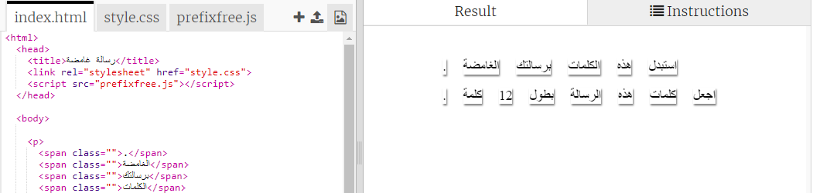
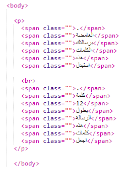
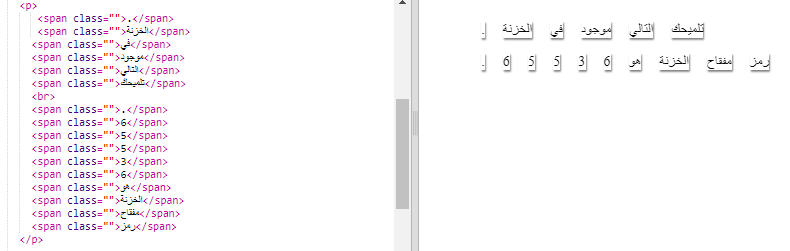

## تحرير رسالتك

Let's get your message onto a webpage.

+ افتح مشروع trinket هذا: <a href="http://jumpto.cc/web-letter" target="_blank">jumpto.cc/web-letter</a>.
    
    الآن يجب أن يبدو الملف الخاص بك مثل هذا:
    
    

+ The `
` paragraph tag is introduced in the 'Happy Birthday' project. The `` tag is used to group smaller pieces of text inside a paragraph so that we can style them.

+ Change the words to your message by putting one word in each ``. You will need to add or remove `` tags if your message is a different length. 

+ Click the Run button to test your trinket.
    
    If you look at the words, you can see that they’ve been styled to look like they’ve been stuck onto the page.