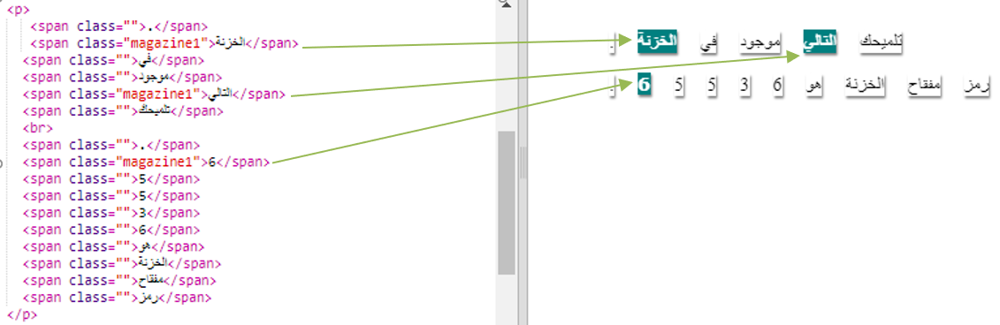
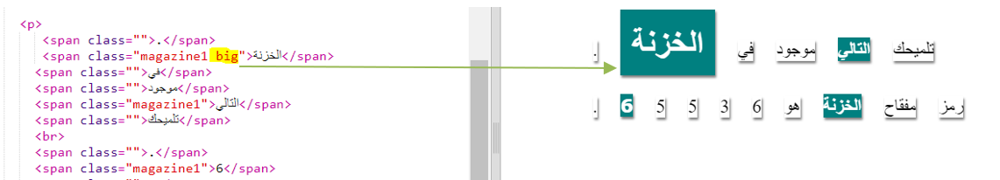

## استخدام أنماط الفئات

+ هل لاحظتَ الفئة `""=class` في الأوسمة ``؟ يمكنك استخدام هذه التقنية لتحديد نمط واحد لأكثر من عنصر. 

+ أضف الفئة `magazine1` إلى بعض أوسمة `` واختبر صفحة الويب.

+ يمكنك إضافة أكثر من فئة إلى عنصر واحد، وذلك بوضع مسافة واحدة بين الفئتين. أضف الفئة `big` إلى أحد أوسمة ``، ثم اختبر صفحتك. 

