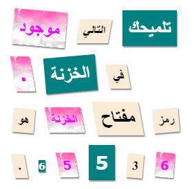

--- challenge ---
## التحدي: حدِّد أنماط رسالتك

استخدم الأنماط المتوفرة لتجعل رسالتك تبدو غامضة. 

أضف هذه الفئات إلى أوسمة ``: 

+ `newspaper`، `magazine1`، `magazine2`

+ `medium`، `big`، `reallybig`

+ `rotateleft`، `rotateright`

+ `skewleft`، `skewright`

لا تُضِف أكثر من فئة واحدة من كل سطر إلى وسم `` واحد.

يمكن أن يكون شكل الرسالة كما يلي:

--- /challenge ---