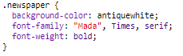

## تحرير الفئات

+ انقر على تبويب **"style.css"**. ابحث عن النمط الخاص بفئة `newspaper` CSS التي كنت تستخدمها.

+ لاحظ أن هناك (نقطة) "." قبل اسم الفئة في ملف CSS ولكن ليس في العلامة `` في مستند HTML.

+ انظر الآن إلى فئات CSS الأخرى التي استخدمتها في تصميم الرسالة الغامضة. هل بامكانك ايجاد:
    
    + كيف النمط النصي في` magazine1 ` يتغير إلى أحرف كبيرة.
    
    + كيف يضع نمط `magazine2` صورة خلف النص.

+ ماذا يحدث إذا قمت بتغيير `background-image` لـ`magazine2 ` إلى ` canvas.png ` ؟؟؟ إذا كنت تفضل `pink-pattern.png` يمكنك تغييره مرة أخرى. 

يمكنك أيضًا تغيير الألوان في أنماط المجلة إذا أردت.

+ ابحث عن CSS المستخدم لتدوير وتشويه (إمالة) كلماتك:

حاول تغيير الأرقام لإنشاء تأثيرات مختلفة ثم قم باختبار صفحتك.