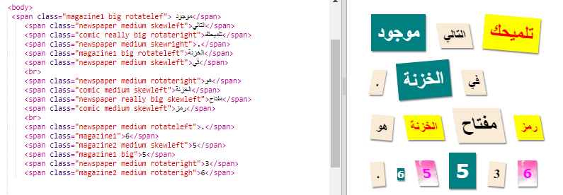
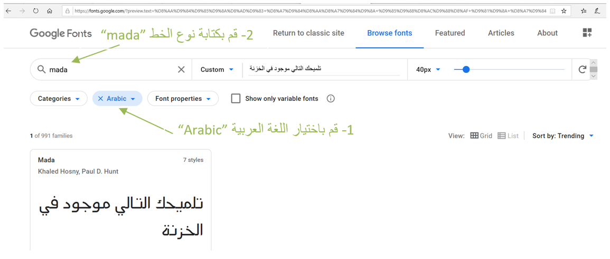
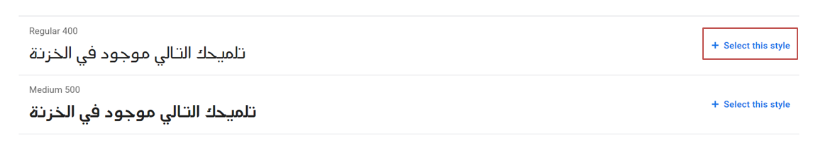
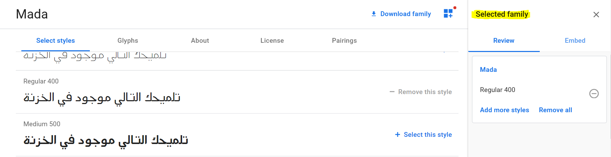
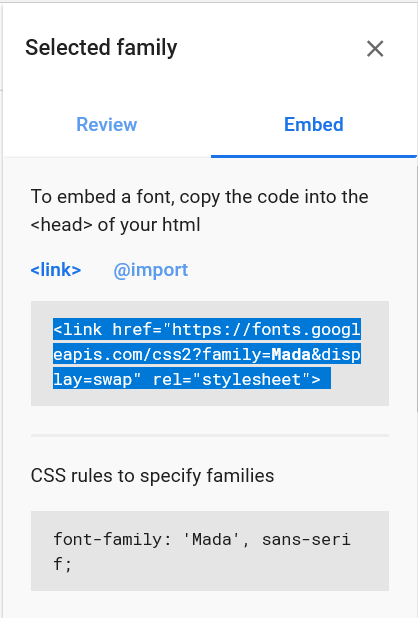
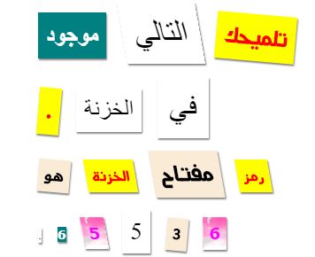

## قم بإنشاء فئة جديدة

دعنا ننشأ نمطاً يبدو كأنه تم قصه من مقطع فكاهي. <a href="http://jumpto.cc/web-fonts" target="_blank">jumpto.cc/web-fonts</a> يوفر الكثير من الخطوط المجانية للاستخدام.

+ أضف صنف `comic` في ملف **style.css**. بعد `magazine2` هو مكان جيد. لا تنسى النقطة أمام اسم الصنف. 

لا تقلق إذا تلقيت تحذيراً يقول "'The Rule is empty" ؛ عليك إصلاح ذلك في الخطوة التالية.

+ أضف الآن بعض CSS إلى فئة comic CSS. يمكنك استخدام ألوان مختلفة إذا أردت. هناك قائمة مليئة بالألوان المختلفة في <a href="http://jumpto.cc/colours" target="_blank">jumpto.cc/colours</a>.

+ استخدم الصنف comic في `` في مستند HTML الخاص بك واختبر صفحتك:

+ الآن يمكنك إضافة خط ممتع. افتح علامة تبويب أو نافذة متصفح جديدة. إنتقل إلى <a href="http://jumpto.cc/web-fonts" target="_blank">jumpto.cc/web-fonts</a> وابحث عن **'Mada'**:

+ انقر فوق الزر "تحديد هذا الخط" +:

ستظهر رسالة تقول "تم اختيار عائلة واحدة" في أسفل الشاشة.

+ انقر على رسالة "1 Family Selected" لفتح النافذة ونسخ الرمز المميز:

+ الصق الكود `<link>` الذي نسخته للتو من خطوط Google إلى `<head>` في ملف ال HTML الخاص بك:

هذا يسمح لك باستخدام الخط Bangers في صفحة الويب الخاصة بك.

+ ارجع إلى خطوط Google وانتقل إلى أسفل الصفحة وانسخ font-family:

+ انتقل الآن إلى ملف **'style.css'** في trinket والصق رمز عائلة الخط في النمط comic:

+ اختبر صفحة الويب الخاصة بك. يجب أن تبدو النتيجة كالتالي: 

