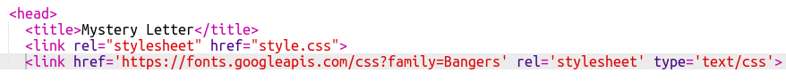

## إنشاء فئة جديدة

دعنا نخلق نمطًا يبدو كأنه تم قصه من فكاهي. <a href="http://jumpto.cc/web-fonts" target="_blank">jumpto.cc/web-fonts</a> يوفر الكثير من الخطوط المجانية للاستخدام.

+ إضافة `فكاهي` فئة في **style.css** الملف. بعد `magazine2` هو مكان جيد. لا تنسى النقطة أمام اسم الفصل. 

لا تقلق إذا تلقيت تحذيرًا يقول "القاعدة فارغة" ؛ عليك إصلاح ذلك بعد ذلك.

+ أضف الآن بعض CSS إلى فئة CSS المصورة. يمكنك استخدام ألوان مختلفة إذا أردت. هناك قائمة الكثير من الألوان في <a href="http://jumpto.cc/colours" target="_blank">jumpto.cc/colours</a>.

+ استخدم النمط الهزلي في بعض علامات `` في مستند HTML الخاص بك واختبر صفحتك:

+ الآن يمكنك إضافة خط ممتع. افتح علامة تبويب أو نافذة متصفح جديدة. انتقل إلى <a href="http://jumpto.cc/web-fonts" target="_blank">jumpto.cc/web- الخطوط</a> وابحث عن **'bangers'**:

+ انقر فوق الزر "تحديد هذا الخط" +:

ستظهر رسالة تقول "تم اختيار عائلة واحدة" في أسفل الشاشة.

+ انقر على رسالة "اختيار عائلة واحدة" لفتح النافذة ونسخ الرمز المميز:

+ الصق الكود `<link>` الذي نسخته للتو من خطوط Google إلى `<head>` من صفحة الويب الخاصة بك:

هذا يسمح لك باستخدام الخط Bangers في صفحة الويب الخاصة بك.

+ ارجع إلى خطوط Google وانتقل إلى أسفل الصفحة وانسخ رمز عائلة الخط:

+ انتقل الآن إلى ملف **'style.css'** في حلية والصق رمز عائلة الخط في النمط الهزلي:

+ اختبار صفحة الويب الخاصة بك. يجب أن تبدو النتيجة مثل هذا: 

