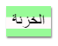

\--- challenge \---

## التحدي: أنشئ نمط طباعة الكمبيوتر

قم بإنشاء نمط مطبوع للكمبيوتر على الطراز القديم وتطبيقه على بعض الكلمات:

سوف تحتاج:

+ عائلة الخطوط `VT323` من <a href="http://jumpto.cc/web-fonts" target="_blank">jumpto.cc/web-fonts</a>. انظر إلى الخطوة 5 إذا كنت بحاجة إلى تذكير باستخدام خطوط Google.

+ صورة خلفية `computer-printout-paper.png`. انظر إلى الخطوة 4 إذا كنت بحاجة إلى تذكير باستخدام صور الخلفية.

\--- challenge/ \---