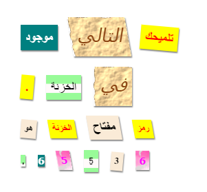

\--- challenge \---

## التحدي: أنشئ أنماطًا من عندك

الآن قم بإنشاء أنماط الفصل الخاصة بك وجعل خطاب الغموض أكثر إثارة للاهتمام. استخدم CSS التي تعلمتها في المشروعات السابقة وانظر إلى الأمثلة في **style.css** للأفكار.

إليك مثالًا:

يمكنك مشاهدة الصور المتاحة للاستخدام من خلال النقر فوق علامة التبويب "الصور" في حلية. حاول تعيين خلفيات صور باستخدام إحدى الصور المضمنة:

+ `الخام-paper.png`

+ `canvas.png`

إذا كان لديك حساب حلية ، يمكنك تحميل صور خاصة بك كما فعلت في مشروع "أخبر قصة".

البحث عن الخطوط التي تريد على <a href="http://jumpto.cc/web-fonts" target="_blank">jumpto.cc/web-fonts</a> ونسخ من `<link>` ورمز CSS في حلية لاستخدامها.

\--- /challenge \---