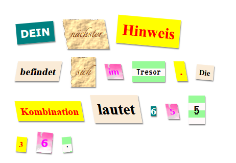

## Einleitung

In diesem Projekt wirst du einen geheimnisvollen Brief erstelle, der so aussieht als wäre jedes Wort aus einer anderen Zeitung, Magazin, Comic oder einer anderen Quelle ausgeschnitten.

### Zusätzliche Information für Clubleiter

Falls du dieses Projekt ausdrucken musst, verwende bitte die [druckfreundliche Version](https://projects.raspberrypi.org/en/projects/mystery-letter/print).

## \--- collapse \---

## title: Anmerkungen für Clubleiter

## Einleitung:

In this project, children are introduced to CSS classes. They use multiple CSS classes to style text and also learn how to use background images and free Google fonts in their projects.

## Online-Ressourcen

We recommend using [trinket](https://trinket.io/) to write HTML & CSS online. This project contains the following trinket:

* ['Mystery Letter' starting point -- jumpto.cc/web-letter](http://jumpto.cc/web-letter)

Die Kinder können auch dieses leere Trinket [(jumpto.cc/html-blank)](http://jumpto.cc/html-blank) verwenden um ihr eigenes HTML & CSS zu schreiben, oder sie können als Alternative dazu dieses Trinket als Vorlage verwenden [(jumpto.cc/html-template)](http://jumpto.cc/html-template).

Es gibt auch ein Trinket mit einer Beispiellösung für die Herausforderungen:

* ['Mystery Letter Finished' -- trinket.io/html/1d4d4c5ce1](https://trinket.io/html/1d4d4c5ce1)

## Offline-Ressourcen

Dieses Projekt kann wahlweise auch [offline](https://www.codeclubprojects.org/en-GB/resources/webdev-working-offline/) durchgeführt werden. Sie können auf die Projektressourcen zugreifen, indem Sie auf den Link "Projektmaterial" für dieses Projekt klicken. Dieser Link enthält einen Abschnitt "Projektressourcen" mit Ressourcen, die die Kinder benötigen, um das Projekt offline abschließen zu können. Stelle sicher, dass jedes Kind Zugriff auf eine Kopie dieser Ressourcen hat. Dieser Abschnitt enthält die folgenden Dateien:

* mystery-letter/index.html
* mystery-letter/style.css
* mystery-letter/script.js
* mystery-letter/prefixfree.js
* mystery-letter/4 x .png images
* template/template.html
* template/style.css

Eine vollständige Version dieses Projekts finden Sie auch im Abschnitt "Ressourcen für Freiwillige". Diese enthält:

* mystery-letter-finished/index.html
* mystery-letter-finished/style.css
* mystery-letter-finished/script.js
* mystery-letter-finished/prefixfree.js
* mystery-letter-finished/4 x .png images

(Alle oben genannten Ressourcen können auch als `.zip`-Dateien für Projekte und für Freiwillige heruntergeladen werden.)

## Lernziele

* This project introduces CSS classes and the ability to style HTML elements with multiple classes.
* Background images and Google fonts are also introduced. 

Dieses Projekt deckt die folgenden Kernbereiche des [Raspberry Pi Digital Making Curriculum](http://rpf.io/curriculum) ab:

* [Entwurf von grundlegenden 2D- and 3D-Konstruktionen](https://www.raspberrypi.org/curriculum/design/creator).

## Herausforderungen

* “Style your message” - Apply provided CSS class styles;
* “Create a computer printout style” - Use CSS to recreate an example class using a background image and Google font. 
* “Create your own styles” - Use CSS to create new styles.

\--- /collapse \---

## \--- collapse \---

## title: Projektmaterial

## Projektressourcen

* [.zip-Datei mit allen Projektressourcen](resources/letter-project-resources.zip)
* [Online Trinket containing all 'Mystery Letter' project resources](http://jumpto.cc/web-letter)
* [Online Trinket-Vorlage](http://jumpto.cc/trinket-template)
* [Leeres online-Trinket](http://jumpto.cc/trinket-blank)
* [template/index.html](resources/template-index.html)
* [template/style.css](resources/template-style.css)
* [mystery-letter/index.html](resources/mystery-letter-index.html)
* [mystery-letter/style.css](resources/mystery-letter-style.css)
* [mystery-letter/prefixfree.js](resources/mystery-letter-prefixfree.js)
* [mystery-letter/rough-paper.png](resources/mystery-letter-rough-paper.png)
* [mystery-letter/canvas.png](resources/mystery-letter-canvas.png)
* [mystery-letter/pink-pattern.png](resources/mystery-letter-pink-pattern.png)
* [mystery-letter/computer-printout-paper.png](resources/mystery-letter-computer-printout-paper.png)

## Ressourcen für Clubleiter

* [.zip-Datei mit allen fertig gestellten Projektressourcen](resources/letter-volunteer-resources.zip)
* [Vollständiges Trinket-Projekt (online)](https://trinket.io/html/1d4d4c5ce1)
* [mystery-letter-finished/index.html](resources/mystery-letter-finished-index.html)
* [mystery-letter-finished/style.css](resources/mystery-letter-finished-style.css)
* [mystery-letter-finished/prefixfree.js](resources/mystery-letter-finished-prefixfree.js)
* [mystery-letter-finished/rough-paper.png](resources/mystery-letter-finished-rough-paper.png)
* [mystery-letter-finished/canvas.png](resources/mystery-letter-finished-canvas.png)
* [mystery-letter-finished/pink-pattern.png](resources/mystery-letter-finished-pink-pattern.png)
* [mystery-letter-finished/computer-printout-paper.png](resources/mystery-letter-finished-computer-printout-paper.png)

\--- /collapse \---