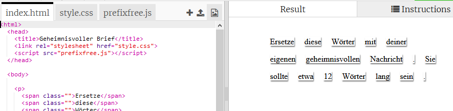
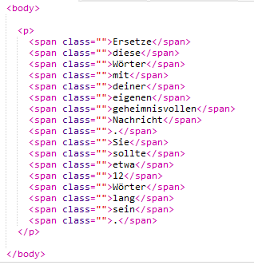
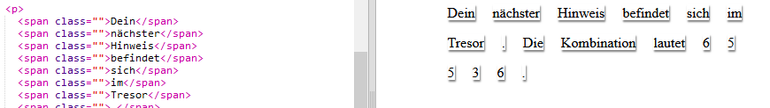

## Bearbeite deine Nachricht

Bringen wir deine Nachricht auf eine web page.

+ Öffne dieses Trinket: <a href="http://jumpto.cc/web-letter" target="_blank">jumpto.cc/web-letter</a>.
    
    Das Projekt sollte so aussehen:
    
    

+ Das `
` Absatz-Tag wurde im Projekt 'Happy Birthday' eingeführt. Die Funktion `` wird benutzt um kleinere Teile von dem Text in einem Absatz zu groupiren so dass man ihn stylen kann.

+ Change the words to your message by putting one word in each ``. You will need to add or remove `` tags if your message is a different length. 

+ Click the Run button to test your trinket.
    
    If you look at the words, you can see that they’ve been styled to look like they’ve been stuck onto the page.