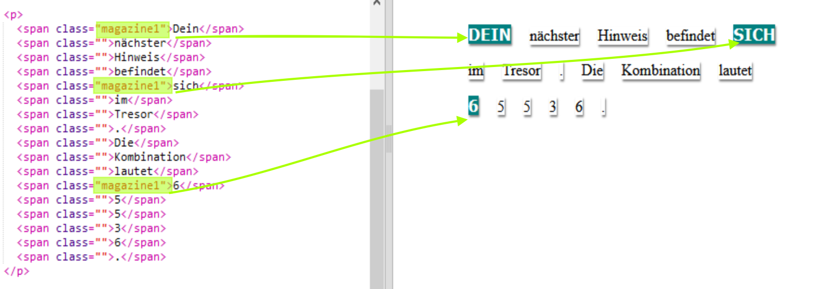
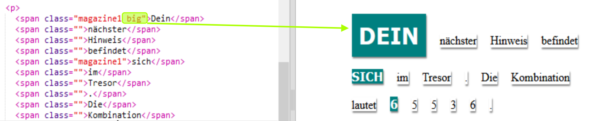

## Verwende Klassenstile

+ Hast du das `class=""` in den ``-Tags bemerkt? Du kannst das nutzen um mehr als eine Sache auf die gleiche Weise zu gestalten.

+ Füge die `magazine1`-Klasse zu einigen deiner ``-Tags hinzu und teste deine Webseite.

+ Du kannst mehr als eine Klasse zu einem Element hinzufügen. Lass einfach ein Leerzeichen dazwischen frei. Füge die `big`-Klasse zu einem deiner ``-Tags hinzu. Teste deine Webseite. 

