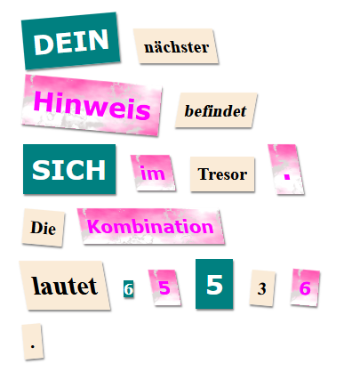

--- challenge ---

## Herausforderung: Gestalte deine Nachricht

Benutze die vorgegebenen Stile um deine Nachricht wie einen geheimnisvollen Brief aussehen zu lassen.

Füge diese Klassen zu deinen ``-Tags hinzu:

+ `newspaper`, `magazine1`, `magazine2`

+ `medium`, `big`, `reallybig`

+ `rotateleft`, `rotateright`

+ `skewleft`, `skewright`

Füge nicht mehr als eine Klasse aus jeder Zeile zu einem bestimmten ``-Tag hinzu.

So könnte dein Brief aussehen:

--- /challenge ---