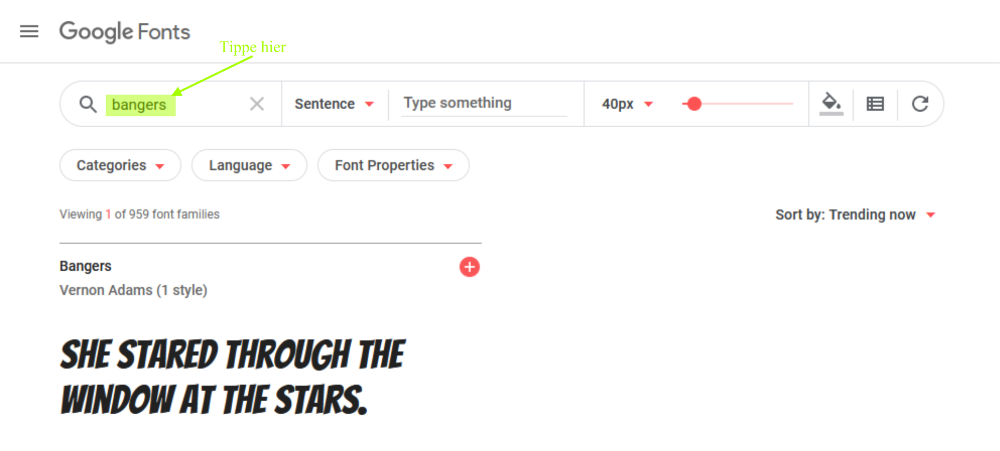
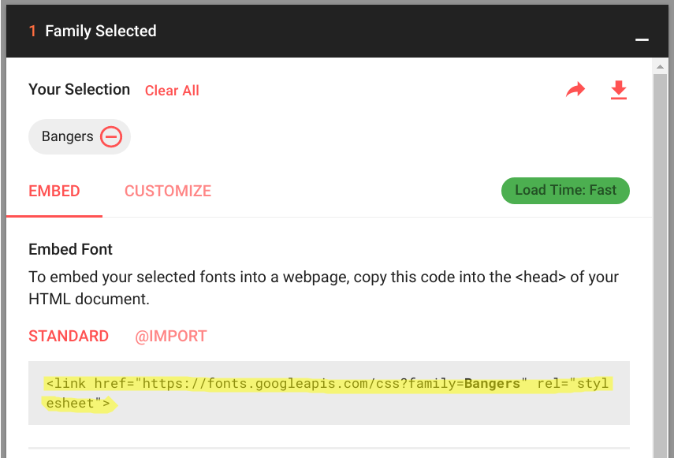

## Eine neue Klasse erzeugen

Lass uns einen Stil erzeugen, der aussieht, als ob er aus einem Comic ausgeschnitten wurde. <a href="http://jumpto.cc/web-fonts" target="_blank">jumpto.cc/web-fonts</a> bietet jede Menge Schriftarten, die man gratis benutzen kann. 

+ Füge eine `comic` Klasse zur __style.css__ Datei hinzu. Nach `magazine2` (Zeitschrift 2) ist ein günstiger Platz. Vergiss nicht den Punkt for dem Klassennamen! 

Keine Bange, falls du eine Warnmeldung erhältst, in der steht: 'The Rule is empty' (Der Maßstab ist leer.), du wirst dies als nächstes beheben. 

+ Füge jetzt den CSS-Code zur Comic CSS Klasse hinzu. Du kannst die verschiedenen Farben benutzen, wenn du willst. Es gibt eine Liste mit jeder Menge an Farben unter <a href="http://jumpto.cc/colours" target="_blank">jumpto.cc/colours</a>.

+ Benutze den Comic-Stil in manchen der `` Tags in deinem HTML Dokument und teste deine Seite:

+ Jetzt kannst du eine tolle Schriftart hinzufügen. Öffne einen neuen Browser-Reiter, bzw. Fenster. Gehe zu <a href="http://jumpto.cc/web-fonts" target="_blank">jumpto.cc/web-fonts</a> und suche nach __'bangers'__:

+ Klicke auf den “Quick-use” (Schnellnutzung) Knopf:

+ Es wird dann eine neue Seite geladen. Scroll-Down bis du Folgendes siehst:

und kopiere den markierten Code. 

+ Füge den `<link>` Code ein, den du soeben von Google-Schriftarten in den `<head>` (Titel) deiner Webseite kopiert hast:

Dies ermöglicht dir, die Bangers-Schriftart auf deiner Webseite zu benutzen. 

+ Gehe zurück zu Google-Schriftarten und Scroll-Down weiter die Seite runter, kopiere dann den Schriftfamilien-Code:

+ Gehe jetzt zu deiner __'style.css'__ Datei in Trinket zurück und füge den Schriftfamilien-Code in deinen Comic-Stil ein:

+ Teste deine Webseite. Das Ergebnis sollte in etwa so aussehen: 

