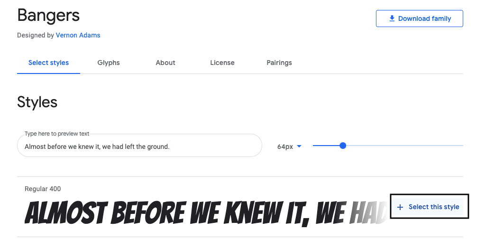
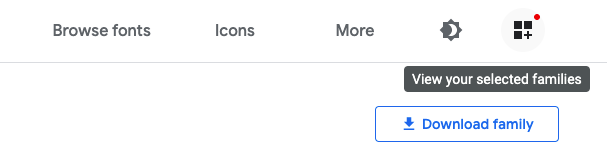

## Eine neue Klasse erstellen

Lass uns einen Stil erstellen, der so aussieht, als wäre etwas aus einem Comic herausgeschnitten worden. <a href="http://jumpto.cc/web-fonts" target="_blank">jumpto.cc/web-fonts</a> bietet viele Schriftarten die du kostenlos nutzen kannst.

+ Füge eine `comic` Klasse in die **style.css** Datei ein. Nach `magazine2` ist ein guter Platz. Vergiss den Punkt vor dem Klassennamen nicht. 

Keine Angst falls du eine Warnung bekommst die sagt "The Rule is empty". Das wirst du als nächstes korrigieren.

+ Jetzt füge ein bisschen CSS zu der Comic CSS-Klasse hinzu. Du kannst auch andere Farben verwenden wenn du willst. Hier gibt es eine Liste mit jeder Menge Farben: <a href="http://jumpto.cc/colours" target="_blank">jumpto.cc/colours</a>.

+ Verwende den Comic-Stil in einigen der ``-Tags in deinem HTML-Dokument und teste deine Seite:

+ Jetzt kannst du eine lustige Schriftart hinzufügen. Öffne einen neuen Browser-Tab oder ein neues Fenster. Gehe auf <a href="http://jumpto.cc/web-fonts" target="_blank">jumpto.cc/web-fonts</a> und suche nach **"bangers"**:

+ Klicke auf die + "Select this font" Schaltfläche:

Am unteren Bildschirmrand wird eine Nachricht erscheinen: "1 Family Selected".

+ Klicke auf die "1 Family Selected" Nachricht, um das Fenster zu öffnen und kopiere den hervorgehobenen Code:

+ Füge den `<link>`-Code, den du gerade von Google Fonts kopiert hast, in den `<head>` deiner Webseite ein:

Das erlaubt es dir die Bangers Schriftart in deiner Webseite zu verwenden.

+ Kehre zu Google Fonts zurück und gehe auf der Seite weiter nach unten und kopiere den font-family Code:

+ Gehe jetzt zu deiner **"style.css"**-Datei in Trinket zurück und füge den font-family Code in den Comic-Stil ein:

+ Teste deine Webseite. Das Ergebnis sollte etwa wie folgt aussehen: 

