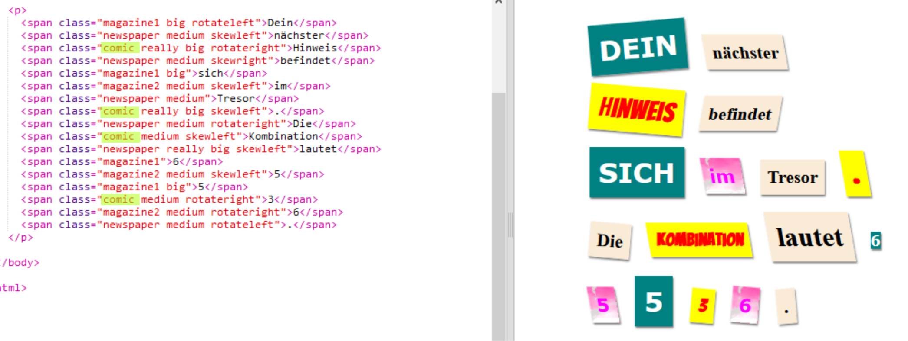

## Eine neue Klasse erzeugen

Jetzt wirst du einen Stil erzeugen der so aussieht als wäre etwas aus einem Comic ausgeschnitten. <a href="http://jumpto.cc/web-fonts" target="_blank">jumpto.cc/web-fonts</a> bietet viele Schriftarten die du kostenlos nutzen kannst.

+ Füge eine `comic` Klasse in die **style.css** Datei ein. Nach `magazine2` ist ein guter Platz. Vergiss den Punkt vor dem Klassennamen nicht. 

Keine Angst falls du eine Warnung bekommst die sagt "The Rule is empty". Das wirst du als nächstes korrigieren.

+ Jetzt füge ein bisschen CSS zu der comic CSS-Klasse hinzu. Du kannst auch andere Farben verwenden, wenn du willst. There's a list of loads of colours at <a href="http://jumpto.cc/colours" target="_blank">jumpto.cc/colours</a>.

+ Use the comic style in some of the `` tags in your HTML document and test your page:

+ Now you can add a fun font. Open a new browser tab or window. Go to <a href="http://jumpto.cc/web-fonts" target="_blank">jumpto.cc/web-fonts</a> and search for **'bangers'**:

+ Click on the + "Select this font" button:

A message saying "1 Family Selected" will appear at the bottom on the screen.

+ Click on the "1 Family Selected" message to open the window and copy the highlighted code:

+ Paste the `<link>` code that you just copied from Google fonts into the `<head>` of your webpage:

This allows you to use the Bangers font in your webpage.

+ Return to Google fonts and scroll further down the page and copy the font-family code:

+ Now go back to your **'style.css'** file in trinket and paste the font-family code into the comic style:

+ Test your webpage. The result should look something like this: 

