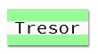

\--- challenge \---

## Herausforderung: Erstelle einen Stil, der wie vom Computer ausgedruckt aussieht

Erstelle einen Stil wie ein altmodischer Computer-Ausdruck und wende ihn auf einige Wörter an:

Was du noch brauchst:

+ Die `VT323` Schriftart von <a href="http://jumpto.cc/web-fonts" target="_blank">jumpto.cc/web-fonts</a>. Schau dir Schritt 5 noch einmal an, falls du eine Erinnerung brauchst wie man Google Fonts verwendet.

+ Das `computer-printout-paper.png` Hintergrundbild. Schau dir Schritt 4 noch einmal an, falls du eine Erinnerung brauchst wie man Hintergrundbilder verwendet.

\--- /challenge \---