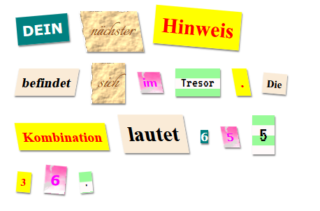

\--- challenge \---

## Herausforderung: Erstelle deine eigenen Stile

Erstelle jetzt deine eigenen Klassenstile und mache deinen geheimnisvollen Brief noch interessanter. Verwende das CSS das du in früheren Projekten gelernt hast und schau auf die Beispiele in **style.css** für Ideen.

Hier ist ein Beispiel:

Du kannst die Bilder die du verwenden kannst sehen indem du auf den Bilder-Reiter in Trinket klickst. Versuche Bildhintergründe einzustellen indem du eines der enthaltenen Bilder verwendest:

+ `rough-paper.png`

+ `canvas.png`

Falls du einen Trinket-Account hast kannst du eigene Bilder hochladen, wie du es bereits im "Erzähl eine Geschichte"-Projekt getan hast.

Finde Schriftarten die du magst auf <a href="http://jumpto.cc/web-fonts" target="_blank">jumpto.cc/web-fonts</a> und kopiere deren `<link>`- und CSS-Code in dein Trinket um sie zu verwenden.

\--- /challenge \---