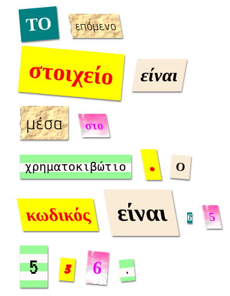

## Εισαγωγή

Σε αυτό το έργο, θα δημιουργήσετε ένα μυστήριο επιστολής που μοιάζει με κάθε λέξη έχει κοπεί από μια διαφορετική εφημερίδα, περιοδικό, κωμικό ή άλλη πηγή.

### Πρόσθετες πληροφορίες για τους ηγέτες των ομάδων

Αν χρειαστεί να εκτυπώσετε αυτό το έργο, παρακαλούμε χρησιμοποιήστε την έκδοση [φιλική προς εκτύπωση](https://projects.raspberrypi.org/en/projects/mystery-letter/print).

## \--- κατάρρευση \---

## τίτλος: Σημειώσεις αρχηγού συλλόγου

## Εισαγωγή:

Σε αυτό το πρόγραμμα, τα παιδιά εισάγονται στις τάξεις CSS. Χρησιμοποιούν πολλαπλές κλάσεις CSS για το στυλ κειμένου και επίσης μαθαίνουν πώς να χρησιμοποιούν εικόνες φόντου και δωρεάν γραμματοσειρές Google στα έργα τους.

## Online Πόροι

Σας συνιστούμε να χρησιμοποιήσετε το [trinket](https://trinket.io/) για να γράψετε HTML & CSS online. Αυτό το έργο περιλαμβάνει το ακόλουθο μπιχλιμπίδι:

* ['Σημείο εκκίνησης μυστηρίου' - jumpto.cc/web-letter](http://jumpto.cc/web-letter)

Τα παιδιά μπορούν επίσης να χρησιμοποιήσουν αυτό το κενό μπιχλιμπίδι [(jumpto.cc/html-blank)](http://jumpto.cc/html-blank) για να γράψουν το δικό τους HTML & CSS, ή εναλλακτικά μπορούν να χρησιμοποιήσουν αυτό το μπιχλιμπίδι πρότυπο [(jumpto.cc/html-template)](http://jumpto.cc/html-template).

Υπάρχει επίσης ένα μπιχλιμπίδι που περιέχει μια λύση δείγματος στις προκλήσεις:

* ['Έγινε η μυστηριώδης επιστολή' - trinket.io/html/1d4d4c5ce1](https://trinket.io/html/1d4d4c5ce1)

## Offline Πόροι

Το έργο αυτό μπορεί να [ολοκληρωθεί χωρίς σύνδεση](https://www.codeclubprojects.org/en-GB/resources/webdev-working-offline/) αν προτιμάτε. Μπορείτε να αποκτήσετε πρόσβαση στους πόρους του έργου κάνοντας κλικ στο σύνδεσμο «Υλικό έργου» για αυτό το έργο. Αυτός ο σύνδεσμος περιέχει μια ενότητα "Πόροι έργου", η οποία περιλαμβάνει πόρους που τα παιδιά θα χρειαστούν για να ολοκληρώσουν αυτό το έργο εκτός σύνδεσης. Βεβαιωθείτε ότι κάθε παιδί έχει πρόσβαση σε ένα αντίγραφο αυτών των πόρων. Αυτή η ενότητα περιλαμβάνει τα ακόλουθα αρχεία:

* μυστήριο-γράμμα / index.html
* μυστήριο-επιστολή / style.css
* μυστήριο-γράμμα / script.js
* μυστήριο-γράμμα / prefixfree.js
* εικόνες μυστηρίου / 4 x .png
* template / template.html
* πρότυπο / style.css

Μπορείτε επίσης να βρείτε μια ολοκληρωμένη έκδοση των προκλήσεων αυτού του έργου στην ενότητα «Πόροι εθελοντών», η οποία περιέχει:

* μυστήριο-τελειωμένο / index.html
* μυστήριο-επιστολή-τελειωμένο / style.css
* μυστήριο-επιστολή-τελείωσε / script.js
* μυστήριο-γράψιμο / prefixfree.js
* εικόνες μυστηρίου-τελειωμένες / 4 x .png

(Όλοι οι παραπάνω πόροι μπορούν επίσης να μεταφορτωθούν ως project και εθελοντικά `.zip` αρχεία.)

## Στόχοι μάθησης

* Αυτό το έργο εισάγει κλάσεις CSS και την ικανότητα να στυλ HTML στοιχεία με πολλαπλές κλάσεις.
* Υποστηρίζονται επίσης εικόνες φόντου και γραμματοσειρές Google. 

Αυτό το έργο καλύπτει στοιχεία από τις ακόλουθες πτυχές του [Raspberry Pi Ψηφιακή Κάνοντας το Αναλυτικό Πρόγραμμα](http://rpf.io/curriculum):

* [Σχεδιασμός βασικών στοιχείων 2D και 3D](https://www.raspberrypi.org/curriculum/design/creator).

## Προκλήσεις

* "Σχεδιάστε το μήνυμά σας" - Εφαρμόστε τα παρεχόμενα στυλ κλάσης CSS.
* "Δημιουργία στυλ εκτύπωσης υπολογιστή" - Χρησιμοποιήστε το CSS για να δημιουργήσετε μια κλάση παράδειγμα χρησιμοποιώντας μια εικόνα φόντου και γραμματοσειρά Google. 
* "Δημιουργήστε το δικό σας στυλ" - Χρησιμοποιήστε το CSS για να δημιουργήσετε νέα στυλ.

\--- /κατάρρευση \---

## \--- κατάρρευση \---

## τίτλος: Υλικό του έργου

## Πόροι του έργου

* [αρχείο .zip που περιέχει όλους τους πόρους του έργου](resources/letter-project-resources.zip)
* [Online Trinket που περιέχει όλους τους πόρους του Έργου "Mystery Letter"](http://jumpto.cc/web-letter)
* [Online πρότυπο Trinket](http://jumpto.cc/trinket-template)
* [Online κενό μπιχλιμπίδι](http://jumpto.cc/trinket-blank)
* [template / index.html](resources/template-index.html)
* [πρότυπο / style.css](resources/template-style.css)
* [μυστήριο-γράμμα / index.html](resources/mystery-letter-index.html)
* [μυστήριο-επιστολή / style.css](resources/mystery-letter-style.css)
* [μυστήριο-γράμμα / prefixfree.js](resources/mystery-letter-prefixfree.js)
* [μυστήριο-επιστολή / τραχύ-χαρτί.png](resources/mystery-letter-rough-paper.png)
* [μυστήριο-επιστολή / canvas.png](resources/mystery-letter-canvas.png)
* [μυστήριο-γράμμα / ροζ-μοτίβο.png](resources/mystery-letter-pink-pattern.png)
* [μυστήριο-γράμμα / υπολογιστή-εκτύπωση-χαρτί.png](resources/mystery-letter-computer-printout-paper.png)

## Πόροι αρχηγού συλλόγου

* [.zip που περιέχει όλους τους πόρους του έργου](resources/letter-volunteer-resources.zip)
* [Online ολοκλήρωση έργου Trinket](https://trinket.io/html/1d4d4c5ce1)
* [μυστήριο-τελειωμένο / index.html](resources/mystery-letter-finished-index.html)
* [μυστήριο-επιστολή-τελειωμένο / style.css](resources/mystery-letter-finished-style.css)
* [μυστήριο-γράψιμο / prefixfree.js](resources/mystery-letter-finished-prefixfree.js)
* [μυστήριο-επιστολή-τελειωμένο / rough-paper.png](resources/mystery-letter-finished-rough-paper.png)
* [μυστήριο-επιστολή-τελειωμένο / canvas.png](resources/mystery-letter-finished-canvas.png)
* [μυστήριο-επιστολή-τελειωμένο / ροζ-pattern.png](resources/mystery-letter-finished-pink-pattern.png)
* [μυστήριο-επιστολή-τελειωμένο / computer-printout-paper.png](resources/mystery-letter-finished-computer-printout-paper.png)

\--- /κατάρρευση \---