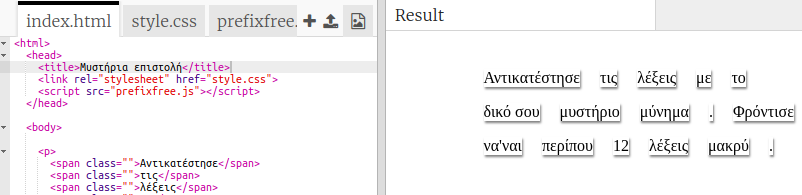
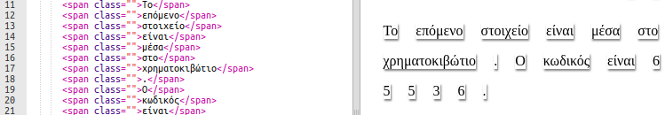

## Επεξεργασία του μηνύματός σου

Ας βάλουμε το μήνυμά σου σε μια ιστοσελίδα.

+ Άνοιξε αυτό το trinket: <a href="http://trinket.io/html/fd58980c0d" target="_blank">trinket.io/html/fd58980c0d</a>.
    
    Το έργο πρέπει να μοιάζει έτσι:
    
    

+ Με την ετικέτα `
` δημιουργείς παραγράφους. Περισσότερα για αυτή την ετικέτα θα βρεις στο έργο "Ευτυχισμένα Γενέθλια". Η ετικέτα `` χρησιμοποιείται για την ομαδοποίηση μικρότερων τμημάτων κειμένου μέσα σε μια παράγραφο, ώστε να τα μορφοποιήσουμε.

+ Άλλαξε τις λέξεις στο μήνυμά σου τοποθετώντας μία λέξη σε κάθε ``. Θα χρειαστεί να προσθέσεις ή να αφαιρέσεις `` ετικέτες εάν το μήνυμά σου έχει διαφορετικό μήκος. 

+ Κάνε κλικ στο κουμπί Run για να δοκιμάσεις το trinket.
    
    Αν κοιτάξεις τις λέξεις, θα δεις ότι έχουν μορφοποιηθεί έτσι ώστε να φαίνονται σαν να έχουν κολληθεί στη σελίδα.