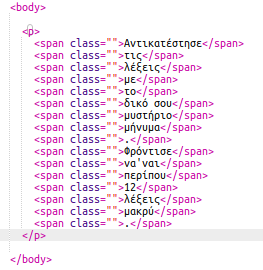

## Επεξεργασία του μηνύματός σας

Ας πάρουμε το μήνυμά σας σε μια ιστοσελίδα.

+ Ανοίξτε αυτό το μπιχλιμπίδι: <a href="http://jumpto.cc/web-letter" target="_blank">jumpto.cc/web-letter</a>.
    
    Το έργο πρέπει να έχει ως εξής:
    
    

+ Η ετικέτα `
` παρατίθεται στο έργο «Happy Birthday». Η ετικέτα `` χρησιμοποιείται για την ομαδοποίηση μικρότερων τμημάτων κειμένου μέσα σε μια παράγραφο, ώστε να τα στυλίσουμε.

+ Αλλάξτε τις λέξεις στο μήνυμά σας τοποθετώντας μία λέξη σε κάθε ``. Θα χρειαστεί να προσθέσετε ή να αφαιρέσετε `` ετικέτες εάν το μήνυμά σας έχει διαφορετικό μήκος. 

+ Κάντε κλικ στο κουμπί Εκτέλεση για να δοκιμάσετε το μπιχλιμπίδι σας.
    
    Αν κοιτάξετε τις λέξεις, μπορείτε να δείτε ότι έχουν σχεδιαστεί έτσι ώστε να φαίνονται σαν να έχουν κολλήσει στη σελίδα.