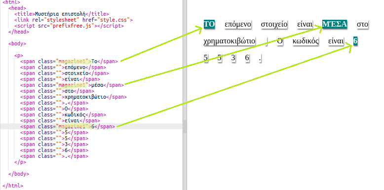
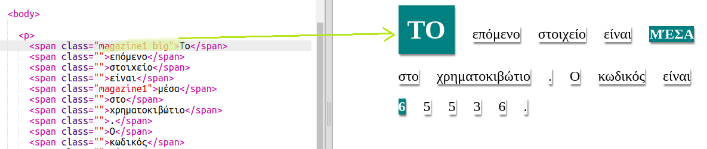

## Χρησιμοποιώντας Στυλ Τάξης

+ Παρατηρήσατε την τάξη `= ""` στις ετικέτες ``; Μπορείτε να χρησιμοποιήσετε αυτό για να στυλ περισσότερο από ένα πράγμα με τον ίδιο τρόπο.

+ Προσθέστε το `magazine1` τάξη σε μερικά από σας `` ετικέτες και να δοκιμάσουν την ιστοσελίδα σας.

+ Μπορείτε να προσθέσετε περισσότερες από μία κατηγορίες σε ένα στοιχείο. Απλά αφήστε ένα κενό μεταξύ τους. Προσθέστε την κλάση `big` σε μία από τις `` ετικέτες σας. Δοκιμάστε τη σελίδα σας. 

