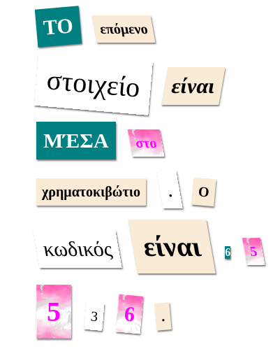

\--- challenge \---

## Πρόκληση: Μορφοποίησε το μήνυμά σου

Χρησιμοποίησε τα διαθέσιμα στυλ για να μορφοποιήσεις το μήνυμά σου σαν μυστήρια επιστολή.

Πρόσθεσε αυτές τις κλάσεις στις ετικέτες ``:

+ `newspaper`, `magazine1`, `magazine2`

+ `medium`, `big`, `reallybig`

+ `rotateleft`, `rotateright`

+ `skewleft`, `skewright`

Μην προσθέτεις περισσότερες από μία κλάσεις από κάθε γραμμή στην ίδια ετικέτα ``.

Έτσι θα μπορούσε να μοιάζει η επιστολή σου:

\--- /challenge \---