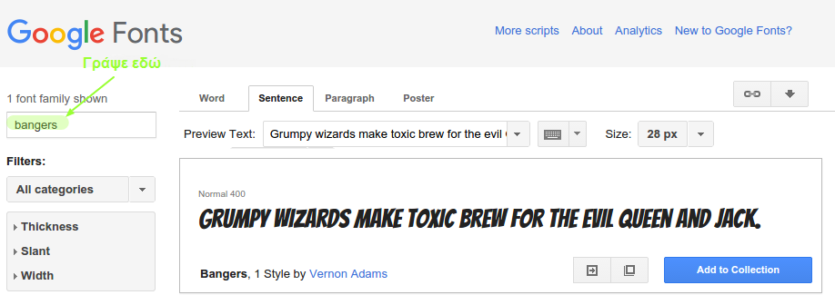
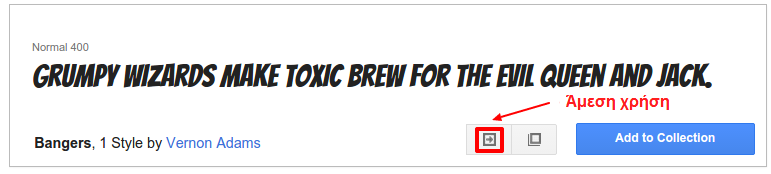

## Δημιουργία νέας κλάσης

Ας δημιουργήσουμε ένα στυλ που μοιάζει να έχει κοπεί από ένα Comic. <a href="http://jumpto.cc/web-fonts" target="_blank">jumpto.cc/web-fonts</a> παρέχει φορτία γραμματοσειρών που είναι ελεύθερα να χρησιμοποιηθούν.

+ Προσθέστε μια κλάση `κωμικό` στο αρχείο **style.css**. Μετά το `magazine2` είναι ένα καλό μέρος. Μην ξεχνάτε την κουκκίδα μπροστά από το όνομα της τάξης. 

Μην ανησυχείτε αν λάβετε μια προειδοποίηση λέγοντας ότι «Ο κανόνας είναι άδειος». θα διορθώσετε το επόμενο.

+ Τώρα προσθέστε CSS στην κωμική κατηγορία CSS. Μπορείτε να χρησιμοποιήσετε διαφορετικά χρώματα, αν θέλετε. Υπάρχει ένας κατάλογος φορτίων χρωμάτων στο <a href="http://jumpto.cc/colours" target="_blank">jumpto.cc/colours</a>.

+ Χρησιμοποιήστε το κωμικό στυλ σε μερικές από τις ετικέτες `` στο έγγραφο HTML και δοκιμάστε τη σελίδα σας:

+ Τώρα μπορείτε να προσθέσετε μια διασκεδαστική γραμματοσειρά. Ανοίξτε μια νέα καρτέλα ή παράθυρο προγράμματος περιήγησης. Πηγαίνετε στο <a href="http://jumpto.cc/web-fonts" target="_blank">jumpto.cc/web-fonts</a> και αναζητήστε **'bangers'**:

+ Κάντε κλικ στο κουμπί γρήγορης χρήσης:

+ Θα φορτωθεί μια νέα σελίδα. Κάντε κύλιση προς τα κάτω μέχρι να δείτε:

και αντιγράψτε τον επισημασμένο κώδικα.

+ Επικολλήστε τον κώδικα `<link>` που μόλις αντιγράψατε από τις γραμματοσειρές Google στα `<head>` της ιστοσελίδας σας:

Αυτό σας επιτρέπει να χρησιμοποιήσετε τη γραμματοσειρά Bangers στην ιστοσελίδα σας.

+ Επιστρέψτε στις γραμματοσειρές Google και μετακινηθείτε προς τα κάτω στη σελίδα και αντιγράψτε τον κωδικό οικογένειας γραμματοσειράς:

+ Τώρα πηγαίνετε πίσω στο αρχείο **'style.css'** σε μπιχλιμπίδι και επικολλήστε τον κώδικα γραμματοσειράς-οικογένειας στο κωμικό στυλ:

+ Δοκιμάστε την ιστοσελίδα σας. Το αποτέλεσμα θα πρέπει να φαίνεται ως εξής: 

