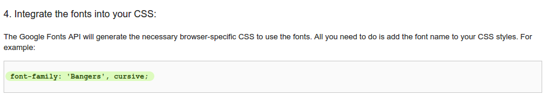

## Δημιουργία νέας κλάσης

Ας δημιουργήσουμε ένα στυλ που μοιάζει να έχει κοπεί από ένα κόμικ. Ο ιστοτόπος <a href="http://jumpto.cc/web-fonts" target="_blank">jumpto.cc/web-fonts</a> παρέχει πλήθος γραμματοσειρών που είναι ελεύθερες προς χρήση.

+ Πρόσθεσε μια κλάση `comic` στο αρχείο **style.css**. Καλό είναι να προστεθεί μετά την `magazine2`. Μην ξεχνάς την τελεία μπροστά από το όνομα της κλάσης. 

Μην ανησυχείς αν δεις μια προειδοποίηση ότι «Ο κανόνας είναι άδειος». θα το διορθώσεις αμέσως μετά.

+ Τώρα πρόσθεσε κώδικα CSS στην κλάση comic. Μπορείς να χρησιμοποιήσεις διαφορετικά χρώματα, αν θέλεις. Υπάρχει ένας κατάλογος πλήθους χρωμάτων στο <a href="http://jumpto.cc/colours" target="_blank">jumpto.cc/colours</a>.

+ Χρησιμοποίησε το στυλ comic σε μερικές από τις ετικέτες `` στο έγγραφο HTML και δες πως μοιάζει η ιστοσελίδα σου:

+ Τώρα μπορείς να προσθέσεις μια αστεία γραμματοσειρά. Άνοιξε μια νέα καρτέλα ή παράθυρο στο πρόγραμμα περιήγησης. Πήγαινε στο <a href="http://jumpto.cc/web-fonts" target="_blank">jumpto.cc/web-fonts</a> και αναζήτησε τη γραμματοσειρά **'bangers'**:

+ Click on the font preview box then click on '+ Select this style':

View your selected fonts by clicking on the 'View your selected families' icon in the top right menu bar:

+ Go to the 'Use on the web' section, copy the text from the <link />
    box:

+ Επικόλλησε τον κώδικα `<link>` που μόλις αντέγραψες από τις γραμματοσειρές Google στην ετικέτα `<head>` της ιστοσελίδας σου:

This allows you to use the Bangers font in your webpage.

+ Return to Google fonts and scroll further down to copy the CSS font-family code:

+ Τώρα πήγαινε στο trinket και στην καρτέλα **'style.css'** και επικόλλησε τον κώδικα στην κλάση comic.

+ Δοκίμασε την ιστοσελίδα σου. Το αποτέλεσμα θα πρέπει να φαίνεται ως εξής: 

