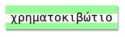

\--- πρόκληση \---

## Πρόκληση: Δημιουργήστε ένα στυλ εκτύπωσης υπολογιστή

Δημιουργήστε ένα ντεμοντέ πρότυπο εκτύπωσης υπολογιστή και εφαρμόστε το σε μερικές από τις λέξεις:

Θα χρειαστείτε:

+ Η οικογένεια γραμματοσειρών `VT323` από <a href="http://jumpto.cc/web-fonts" target="_blank">jumpto.cc/web-fonts</a>. Ανατρέξτε στο βήμα 5 εάν χρειάζεστε μια υπενθύμιση σχετικά με τη χρήση των γραμματοσειρών Google.

+ Η εικόνα `υπολογιστή-εκτύπωσης-χαρτιού.png`. Ανατρέξτε στο βήμα 4 εάν χρειάζεστε μια υπενθύμιση για τη χρήση εικόνων φόντου.

\--- / πρόκληση \---