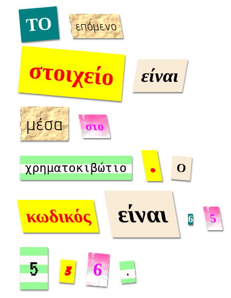

--- challenge ---

## Πρόκληση: Δημιούργησε τα δικά σου στυλ

Τώρα δημιούργησε τα δικά σου στυλ κλάσεων και κάνε την μυστήρια επιστολή σου ακόμα πιο ενδιαφέρουσα. Χρησιμοποίησε κώδικα CSS που έχεις μάθει σε προηγούμενα έργα και δες τα παραδείγματα στο **style.css** για ιδέες.

Ακολουθεί ένα παράδειγμα:

Μπορείς να δεις τις εικόνες που είναι διαθέσιμες για χρήση κάνοντας κλικ στην καρτέλα Images στο trinket. Δοκίμασε να ορίσεις εικόνα φόντου χρησιμοποιώντας μία από τις εικόνες που περιλαμβάνονται:

+ `rough-paper.png`

+ `canvas.png`

Εάν διαθέτεις λογαριασμό στην εφαρμογή Trinket, μπορείς να ανεβάσεις δικές σου φωτογραφίες όπως στο έργο 'Πες μια ιστορία'.

Βρες τις γραμματοσειρές που σου αρέσουν στο <a href="http://jumpto.cc/web-fonts" target="_blank">jumpto.cc/web-fonts</a> και αντέγραψε τον κώδικα HTML `<link>` και CSS στο trinket σου για να τις χρησιμοποιήσεις.

--- /challenge ---
***
### Κοινοτική συνεισφορά μετάφρασης 

Το έργο αυτό μεταφράστηκε από **Γιώργος Νικολαΐδης** και αναθεωρήθηκε από **Μάνος Ζεάκης**. 

Οι εκπληκτικοί μας εθελοντές-μεταφραστές μας βοηθούν να δώσουμε στα παιδιά όλου του κόσμου την ευκαιρία να μάθουν να προγραμματίζουν. Μπορείτε να μας βοηθήσετε να προσεγγίσουμε περισσότερα παιδιά μεταφράζοντας τα έργα μας - διαβάστε περισσότερα στο [rpf.io/translators](https://rpf.io/translators).
