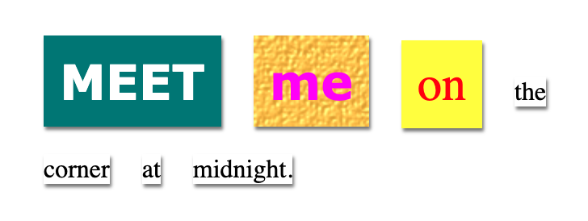
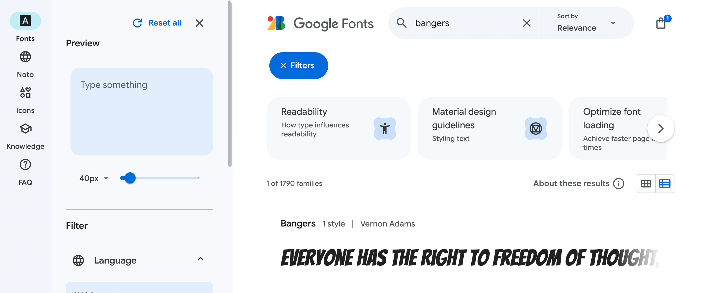
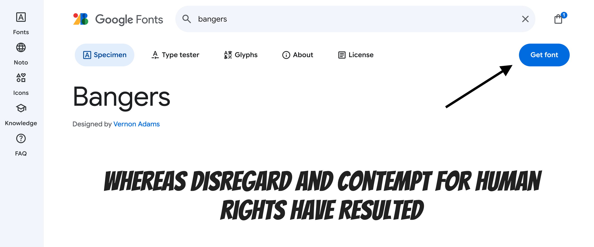
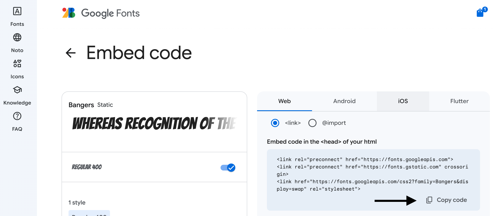
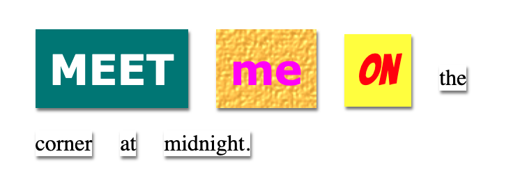

## Create a new class 

Create a style for a word that looks like it has been cut from a comic. 

--- task ---

In the __style.css__ file, add a `comic` class. Don't forget the dot in front of the class name. 

--- code ---
---
language: css
line_numbers: true
line_number_start: 28
line_highlights: 35-37

---
.magazine2 {
  background-image: url('canvas.png');
  color: fuchsia;
  font-family: Verdana;
  font-weight: 900;
}

.comic {

}

--- /code ---
--- /task ---

--- task ---

Add a text colour and background colour to the comic CSS class. 

--- code ---
---
language: css
line_numbers: true
line_number_start: 35
line_highlights: 36-37

---
.comic {
    color: red;
    background-color: yellow;
}

--- /code ---

There's a list of loads of colours at <a href="http://jumpto.cc/colours" target="_blank">jumpto.cc/colours</a> - use different colours if you prefer.

--- /task ---

--- task ---
Switch back to `index.html`. Apply the comic style to one of the `` tags.

--- code ---
---
language: html
line_numbers: true
line_number_start: 11
line_highlights: 14

---

    Meet
    me
    on

--- /code ---

--- /task ---

--- task ---
Click **Run** to see what your new style looks like.

--- /task ---

--- task ---
Open [http://jumpto.cc/web-fonts](http://jumpto.cc/web-fonts){:target="_blank"} and search for __'bangers'__:

--- /task ---

--- task ---
Click on the font, then click on 'Get font':

--- /task ---

--- task ---

Click on 'Get embed code' and then click on the 'Copy code' button.

--- /task ---

--- task ---
Go back to your `index.html` file and paste the `<link>` code that you just copied into the `<head>` of your webpage:

--- code ---
---
language: html
line_numbers: true
line_number_start: 3
line_highlights: 7-9

---
<head>
    <title>Mystery Letter</title>
    <link rel="stylesheet" href="style.css">
    
    <link rel="preconnect" href="https://fonts.googleapis.com">
    <link rel="preconnect" href="https://fonts.gstatic.com" crossorigin>
    <link href="https://fonts.googleapis.com/css2?family=Bangers&display=swap" rel="stylesheet">
</head>
--- /code ---

This allows you to use the 'Bangers' font in your webpage.

--- /task ---

--- task ---

Switch to your __'style.css'__ file and add the font-family code into the comic style:

--- code ---
---
language: css
line_numbers: true
line_number_start: 35
line_highlights: 38

---
.comic {
    color: red;
    background-color: yellow;
    font-family: "Bangers", serif;
}

--- /code ---
--- /task ---

--- task ---
Click **Run** to test your webpage. The result should look something like this: 

--- /task ---

