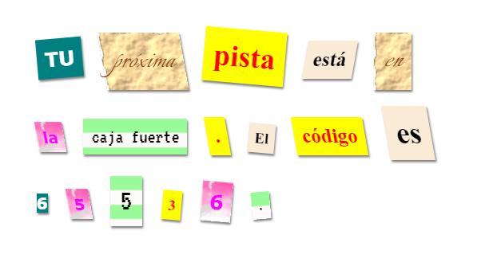

## Introducción

En este proyecto crearás una carta misteriosa en la cual cada palabra ha sido recortada de diferentes periódicos, revistas, historietas u otras fuentes.

### Información adicional para líderes de club

Si necesita imprimir este proyecto, usa la [versión para imprimir](https://projects.raspberrypi.org/en/projects/mystery-letter/print).

## \--- collapse \---

## título: Notas del líder del club

## Introducción:

En este proyecto los niños serán introducidos al concepto de categorías o clases en CSS. Usarán categorías en CSS para diseñar textos y también aprenderán a usar imágenes de fondo y fuentes gratis de Google en sus proyectos.

## Recursos en línea

Se recomienda el uso de [trinket](https://trinket.io/) para escribir HTML & CSS en línea. Este proyecto usa el siguiente trinket:

* ['Carta Misteriosa' punto de partida -- jumpto.cc/web-letter](http://jumpto.cc/web-letter)

Los niños también pueden hacer uso de este trinket en blanco [ (jumpto.cc/html-blank) ](http://jumpto.cc/html-blank) para escribir su propio HTML & CSS, o alternativamente pueden usar este trinket plantilla [(jumpto.cc/html-template)](http://jumpto.cc/html-template).

También hay un trinket que contiene una solución de muestra para los desafíos:

* ['Carta Misteriosa Terminada' -- trinket.io/html/1d4d4c5ce1](https://trinket.io/html/1d4d4c5ce1)

## Recursos sin conexión

This project can be [completed offline](https://rpf.io/html-offline) if preferred. Se puede acceder a los recursos del proyecto haciendo clic en el enlace 'Materiales del proyecto' en este proyecto. Este enlace contiene una sección de 'Recursos del proyecto', que incluye los recursos que los niños necesitarán para completar este proyecto sin conexión. Asegúrate de que cada niño tenga acceso a una copia de estos recursos. Esta sección incluye los siguientes archivos:

* mystery-letter/index.html
* mystery-letter/style.css
* mystery-letter/script.js
* mystery-letter/prefixfree.js
* mystery-letter/4 x .png images
* template/template.html
* template/style.css

También puede encontrar una versión completa de los desafíos de este proyecto en la sección 'Recursos para voluntarios', que contiene:

* mystery-letter-finished/index.html
* mystery-letter-finished/style.css
* mystery-letter-finished/script.js
* mystery-letter-finished/prefixfree.js
* mystery-letter-finished/4 x .png images

(Todos los recursos anteriores también se pueden descargar como archivos `.zip` de proyectos y voluntarios.)

## Objetivos del Aprendizaje

* Este proyecto introduce a categorías en CSS y a la habilidad de diseñar elementos en HTML con multiples categorías.
* También se presentan las imágenes de fondo y fuentes de Google. 

Este proyecto incluye elementos de los siguientes contenidos del [curríulo de digitalización de Raspberry Pi](http://rpf.io/curriculum):

* [Diseño de elementos básicos en 2D y 3D](https://www.raspberrypi.org/curriculum/design/creator).

## Retos

* "Personaliza tu mensaje" - Usa estilos basados en clases de CSS proporcionados;
* "Crea un estilo de impresión" - Usa CSS para recrear una clase de ejemplo usando una imagen de fondo y una fuente de Google. 
* "Crea tu propios estilos" - Usa CSS para crear nuevos estilos.

\--- /collapse \---

## \--- collapse \---

## title: Materiales del proyecto

## Recursos del proyecto

* [Archivo .zip que contiene todos los recursos del proyecto](https://rpf.io/p/en/mystery-letter-go)
* [Trinket en línea que contiene todos los recursos del proyecto "Carta Misteriosa"](http://jumpto.cc/web-letter)
* [Plantilla de Trinket en línea](http://jumpto.cc/trinket-template)
* [Trinket vacío en línea](http://jumpto.cc/trinket-blank)
* [template/index.html](resources/template-index.html)
* [template/style.css](resources/template-style.css)
* [mystery-letter/index.html](resources/mystery-letter-index.html)
* [mystery-letter/style.css](resources/mystery-letter-style.css)
* [mystery-letter/prefixfree.js](resources/mystery-letter-prefixfree.js)
* [mystery-letter/rough-paper.png](resources/mystery-letter-rough-paper.png)
* [mystery-letter/canvas.png](resources/mystery-letter-canvas.png)
* [mystery-letter/pink-pattern.png](resources/mystery-letter-pink-pattern.png)
* [mystery-letter/computer-printout-paper.png](resources/mystery-letter-computer-printout-paper.png)

## Recursos para los líderes de clubes

* [Archivo .zip que contiene todos los recursos de proyecto terminado](https://rpf.io/p/en/mystery-letter-go)
* [Proyecto Trinket terminado en línea](https://trinket.io/html/1d4d4c5ce1)
* [mystery-letter-finished/index.html](resources/mystery-letter-finished-index.html)
* [mystery-letter-finished/style.css](resources/mystery-letter-finished-style.css)
* [mystery-letter-finished/prefixfree.js](resources/mystery-letter-finished-prefixfree.js)
* [mystery-letter-finished/rough-paper.png](resources/mystery-letter-finished-rough-paper.png)
* [mystery-letter-finished/canvas.png](resources/mystery-letter-finished-canvas.png)
* [mystery-letter-finished/pink-pattern.png](resources/mystery-letter-finished-pink-pattern.png)
* [mystery-letter-finished/computer-printout-paper.png](resources/mystery-letter-finished-computer-printout-paper.png)

\--- /collapse \---