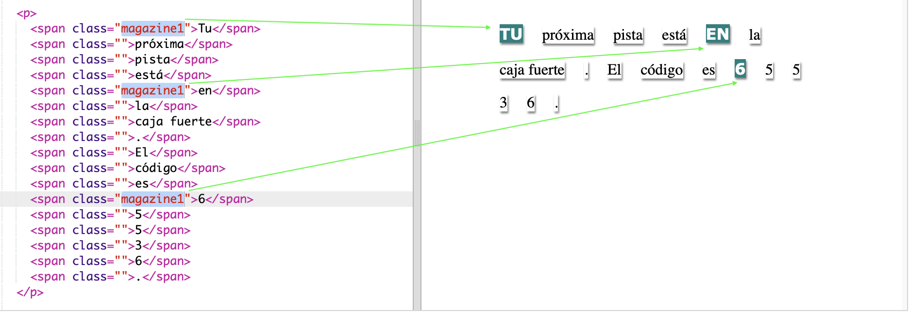
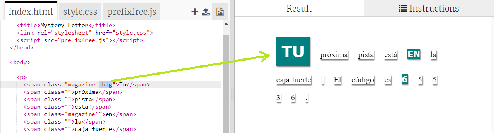

## Usar estilos Class

+ Reparaste en la `class=""` en las etiquetas ``? Puedes usarla para diseñar más de una cosa de la misma manera.

+ Añade la clase `magazine1` a algunas de tus etiquetas `` y prueba tu página web.

+ Puedes añadir más de una clase a un elemento. Solamente deja un espacio en el medio. Añade la clase `big` a uno de tus etiquetas ``. Prueba tu página. 

