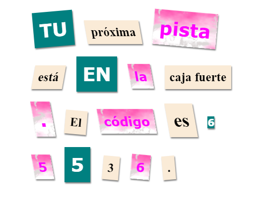

\--- challenge \---

## Reto: Cambiar el estilo de tu mensaje

Usa los estilos disponibles para hacer que tus mensajes parezcan una carta misteriosa.

Añade estas clases a tus etiquetas ``:

+ `newspaper`, `magazine1`, `magazine2`

+ `medium`, `big`, `reallybig`

+ `rotateleft`, `rotateright`

+ `rotateleft`, `rotateright`

No añadas más de una clase de cada línea para un `` en particular.

Tu carta podría quedar así:

\--- /challenge \---