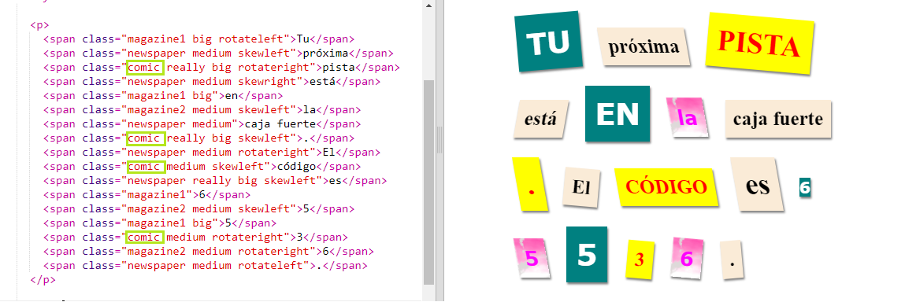
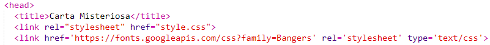
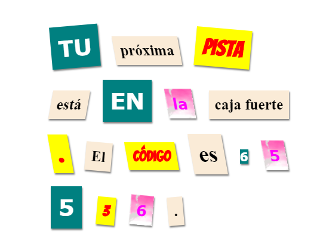

## Crear una nueva categoría

Vamos a crear un estilo que parezca sacado de una historieta. <a href="http://jumpto.cc/web-fonts" target="_blank">jumpto.cc/web-fonts</a> provides loads of fonts that are free to use.

+ Add a `comic` class in the **style.css** file. After `magazine2` is a good place. Don't forget the dot in front of the class name. 

Don't worry if you get a warning saying that 'The Rule is empty'; you'll fix that next.

+ Now add some CSS to the comic CSS class. You can use different colours if you like. There's a list of loads of colours at <a href="http://jumpto.cc/colours" target="_blank">jumpto.cc/colours</a>.

+ Use the comic style in some of the `` tags in your HTML document and test your page:

+ Now you can add a fun font. Open a new browser tab or window. Go to <a href="http://jumpto.cc/web-fonts" target="_blank">jumpto.cc/web-fonts</a> and search for **'bangers'**:

+ Click on the + "Select this font" button:

A message saying "1 Family Selected" will appear at the bottom on the screen.

+ Click on the "1 Family Selected" message to open the window and copy the highlighted code:

+ Paste the `<link>` code that you just copied from Google fonts into the `<head>` of your webpage:

This allows you to use the Bangers font in your webpage.

+ Return to Google fonts and scroll further down the page and copy the font-family code:

+ Now go back to your **'style.css'** file in trinket and paste the font-family code into the comic style:

+ Test your webpage. The result should look something like this: 

