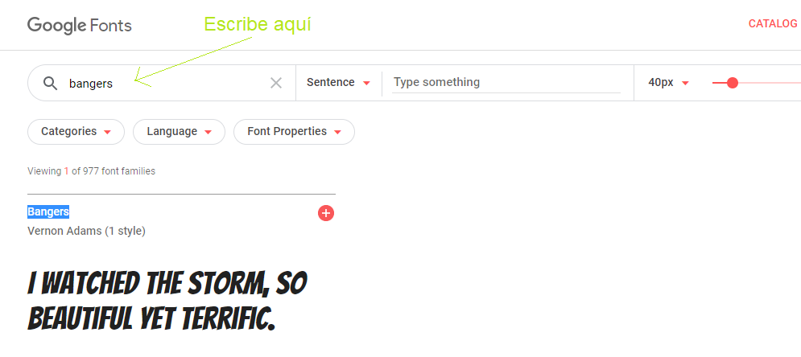

## Crear una nueva categoría

Vamos a crear un estilo que parezca que ha sido recortado de un cómic. <a href="http://jumpto.cc/web-fonts" target="_blank">jumpto.cc/web-fonts</a> ofrece un montón de fuentes que son de uso libre.

+ Añade una categoría de `comic` en el archivo __style.css__. Después de `magazine2` es un buen sitio. No te olvides de poner un punto delante del nombre de la categoría.

No te preocupes si te aparece un mensaje diciendo 'The Rule is empty' (La regla está vacía), arreglaremos eso enseguida.

+ Ahora añade algo de CSS a la categoría de CSS comic. Si quieres, puedes usar diferentes colores. Puedes encontrar una lista con un montón de colores en <a href="http://jumpto.cc/web-colours" target="_blank">jumpto.cc/web-colours</a>.

+ Usa el estilo comic en algunas de las etiquetas `` de tu documento HTML y prueba tu página:

+ Ahora puedes añadir un tipo de letra divertido. Abre una nueva pestaña o ventana en el navegador. Ve a <a href="http://jumpto.cc/web-fonts" target="_blank">jumpto.cc/web-fonts</a> y busca __'bangers'__:

+ Haz clic en el botón de "Quick-use" (Uso rápido):

+ Entonces se cargará una nueva página. Desplázate hacia abajo en la pantalla hasta que veas:

y copia el código marcado.

+ Pega el código del `<enlace>` que acabas de copiar de Google fonts en la `<cabecera>` de tu página web:

Esto te permitirá usar el tipo de letra Bangers en tu página web.

+ Vuelve a Google fonts, desplázate aún más hacia abajo en la pantalla, y copia el código del tipo de letra ("font-family"):

+ A continuación vuelve a tu archivo __'style.css'__ en trinket y pega el código del tipo de letra en el estilo comic:

+ Prueba tu página web. El resultado debería de parecerse a éste:

