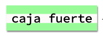

\--- challenge \---

## Reto: Crear un estilo de impresión de ordenador

Crea un antiguo estilo de impresión de ordenador y úsalo para algunas palabras:

Necesitarás:

+ La familia de fuentes `VT323` de <a href="http://jumpto.cc/web-fonts" target="_blank">jumpto.cc/web/fonts</a>. Regresa al paso 5 si necesitas rememorar el uso de las fuentes Google.

+ La imagen de fondo `computer-printout-paper.png`. Regresa al paso 4 si necesitas recordar acerca del uso de imágenes de fondo.

\--- /challenge \---