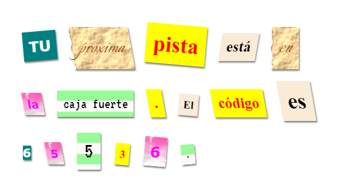

\--- challenge \---

## Reto: Crear tus propios estilos

Ahora crea tu propio estilo y haz tu carta misteriosa aún más interesante. Usa lo aprendido acerca de CSS en proyectos anteriores y revisa los ejemplos en **style.css** para obtener ideas.

Aquí está un ejemplo:

Puede ver las imágenes disponibles haciendo clic en la pestaña Images en trinket. Intenta colocar imágenes de fondo usando una de las imágenes añadidas:

+ `rough-paper.png`

+ `canvas.png`

Si tienes una cuenta en trinket puede subir imágenes de tu propia autoría como lo hiciste en el proyecto 'Contando una historia'.

Encuentra las fuentes de tu preferencia en <a href="http://jumpto.cc/web-fonts" target="_blank">jumpto.cc/web-fonts</a> y copia los `<link>` y códigos CSS en su trinket para usarlos.

\--- /challenge \---