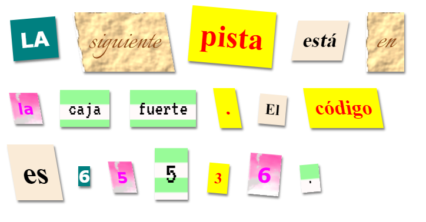

## Introducción

En este proyecto crearás una carta misteriosa en la que parece que cada letra fue cortada de un periódico, revista, comic o alguna otra fuente.

### Información adicional para los líderes del club

Si necesitas imprimir este proyecto, usa la [versión para imprimir](https://projects.raspberrypi.org/es-LA/projects/mystery-letter/print).

--- collapse ---
---
title: Notas para el líder del club
---

## Introducción:

En este proyecto, los niños serán introducidos a las clases CSS. Ellos usarán categorías en CSS para diseñar textos y también aprenderán a usar imágenes de fondo y fuentes gratis de Google en sus proyectos.

## Recursos en línea

Recomendamos usar [trinket](https://trinket.io/) para programar en HTML y CSS en línea. Este proyecto contiene el siguiente trinket:

* [Punto de inicio de 'Carta Misteriosa' -- trinket.io/html/12f6de4299](https://trinket.io/html/12f6de4299)

Los niños también pueden hacer uso de este trinket en blanco [(jumpto.cc/html-blank)](http://jumpto.cc/html-blank) para escribir su propio HTML & CSS o alternativamente pueden usar esta plantilla de trinket [(jumpto.cc/html-template)](http://jumpto.cc/html-template).

También hay un trinket que contiene una solución de muestra para los desafíos:

* ['Carta Misteriosa Terminada' -- trinket.io/html/bd0eca6a36](https://trinket.io/html/bd0eca6a36)

## Recursos sin conexión

Este proyecto se puede [completar sin conexión](https://www.codeclubprojects.org/en-GB/resources/webdev-working-offline/) si se prefiere. Puedes acceder a los recursos del proyecto haciendo clic en el enlace 'Materiales del proyecto' para este proyecto. Este enlace contiene una sección de 'Recursos del proyecto', que incluye los recursos que niños y niñas necesitarán para completar este proyecto sin conexión. Asegúrate de que cada niño tenga acceso a una copia de estos recursos. Esta sección incluye los siguientes archivos:

* mystery-letter/index.html
* mystery-letter/style.css
* mystery-letter/script.js
* mystery-letter/prefixfree.js
* mystery-letter/4 x .png images
* template/template.html
* template/style.css

También puedes encontrar una versión completa de los desafíos de este proyecto en la sección 'Recursos para voluntarios', que contiene:

* mystery-letter-finished/index.html
* mystery-letter-finished/style.css
* mystery-letter-finished/script.js
* mystery-letter-finished/prefixfree.js
* mystery-letter-finished/4 x .png images

(Todos los recursos anteriores también se pueden descargar como archivos `.zip` de proyectos y voluntarios.)

## Objetivos del Aprendizaje

* Este proyecto introduce las clases CSS y la habilidad de estilizar elementos HTML con múltiples clases.
* También se introducen imágenes de fondo y tipos de letra de Google. 

Este proyecto incluye los siguientes aspectos del [Curríulo de Creación Digital de Raspberry Pi](http://rpf.io/curriculum):

* [Diseño de elementos básicos en 2D y 3D](https://www.raspberrypi.org/curriculum/design/creator).

## Desafíos

* "Estiliza tu mensaje" - Aplica las clases de estilo CSS suministradas;
* "Crea un estilo de impresión" - Usa CSS para crear un ejemplo de clases usando una imagen de fondo y una fuente de Google. 
* "Crea tus propios estilos" - Usa CSS para crear nuevos estilos.

--- /collapse ---

--- collapse ---
---
title: Materiales del proyecto
---

## Recursos del proyecto

* [Archivo.zip que contiene todos los recursos del proyecto](https://rpf.io/p/es-LA/mystery-letter-go)
* [Trinket en línea que contiene todos los recursos del proyecto 'Carta Misteriosa'](https://trinket.io/html/12f6de4299)
* [Plantilla de Trinket en línea](http://jumpto.cc/trinket-template)
* [Trinket en blanco en línea](http://jumpto.cc/trinket-blank)
* [template/index.html](resources/template-index.html)
* [template/style.css](resources/template-style.css)
* [mystery-letter/index.html](resources/mystery-letter-index.html)
* [mystery-letter/style.css](resources/mystery-letter-style.css)
* [mystery-letter/prefixfree.js](resources/mystery-letter-prefixfree.js)
* [mystery-letter/rough-paper.png](resources/mystery-letter-rough-paper.png)
* [mystery-letter/canvas.png](resources/mystery-letter-canvas.png)
* [mystery-letter/pink-pattern.png](resources/mystery-letter-pink-pattern.png)
* [mystery-letter/computer-printout-paper.png](resources/mystery-letter-computer-printout-paper.png)

## Recursos del líder del club

* [Archivo.zip que contiene todos los recursos del proyecto terminado](https://rpf.io/p/es-LA/mystery-letter-go)
* [Proyecto Trinket completado en línea](https://trinket.io/html/bd0eca6a36)
* [mystery-letter-finished/index.html](resources/mystery-letter-finished-index.html)
* [mystery-letter-finished/style.css](resources/mystery-letter-finished-style.css)
* [mystery-letter-finished/prefixfree.js](resources/mystery-letter-finished-prefixfree.js)
* [mystery-letter-finished/rough-paper.png](resources/mystery-letter-finished-rough-paper.png)
* [mystery-letter-finished/canvas.png](resources/mystery-letter-finished-canvas.png)
* [mystery-letter-finished/pink-pattern.png](resources/mystery-letter-finished-pink-pattern.png)
* [mystery-letter-finished/computer-printout-paper.png](resources/mystery-letter-finished-computer-printout-paper.png)

--- /collapse ---