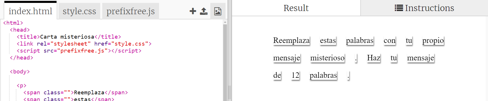
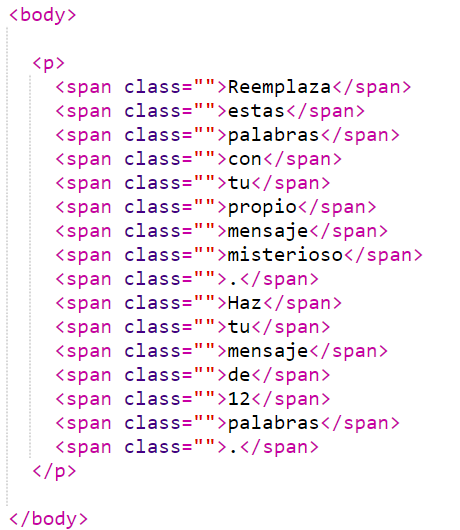
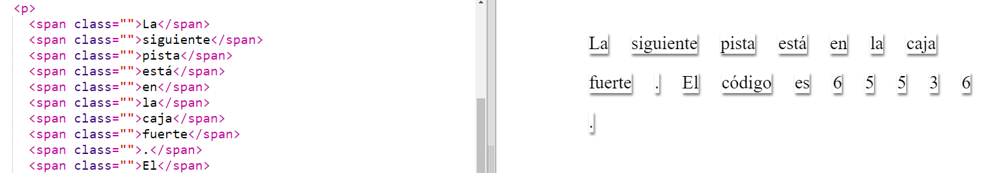

## Editando tu mensaje

Pongamos tu mensaje en una página web.

+ Abre este trinket: <a href="http://jumpto.cc/web-letter" target="_blank">jumpto.cc/web-letter</a>.
    
    El proyecto se debe ver así:
    
    

+ La etiqueta de párrafo `
` es introducida en el proyecto de 'Feliz Cumpleaños'. La etiqueta `` es utilizada para agrupar piezas pequeñas de texto dentro de un párrafo, para que se les pueda aplicar estilo.

+ Cambia las palabras de tu mensaje poniendo una palabra en cada ``. Necesitarás agregar o quitar etiquetas `` si tu mensaje es de una longitud diferente. 

+ Presiona el botón de Run para probar tu trinket.
    
    Si observa las palabras, puede ver que han sido diseñadas para que parezcan pegadas a la página.