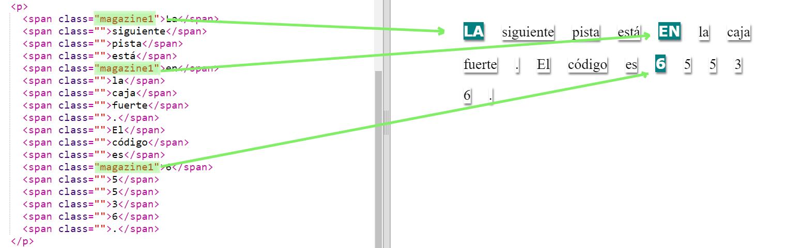
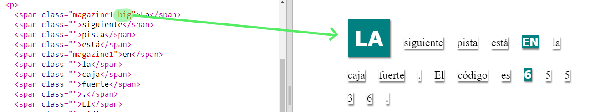

## Usando Clases de Estilo

+ ¿Notaste la `class=""` en las etiquetas ``? Puedes usarla para dar estilo a más de una cosa de la misma manera.

+ Agrega la clase `magazine1` a algunas de tus etiquetas `` y prueba tu página web.

+ Puedes agregar más de una clase a un elemento. Solo deja un espacio en medio. Agrega la clase `big` a una de tus etiquetas ``. Prueba tu página web. 

