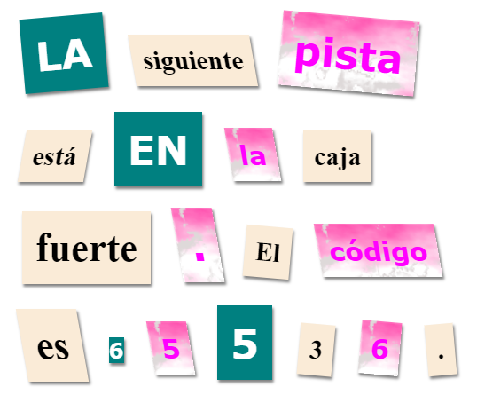

\--- challenge \---

## Reto: Dale Estilo a tu Mensaje

Usa los estilos proporcionados para hacer que tu mensaje parezca una carta misteriosa.

Agrega estas clases a tus etiquetas ``:

+ `newspaper`, `magazine1`, `magazine2`

+ `medium`, `big`, `reallybig`

+ `rotateleft`, `rotateright`

+ `skewleft`, `skewright`

No agregues más de una clase de cada línea a una sola etiqueta ``.

Así es como se podría ver tu carta:

\--- /challenge \---