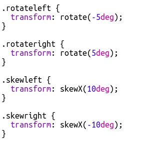

## Editando Clases

+ Presiona la pestaña **'style.css'**. Encuentra el estilo para la clase CSS `newspaper` que has estado usando.

+ Observa que hay un punto (punto final) '.' antes del nombre de la clase en el archivo CSS pero no en la etiqueta `` en tu documento HTML.

+ Now look at the other CSS classes that you used to style your mystery letter. Can you find:
    
    + How the `magazine1` style changes the text to all uppercase (capital) letters.
    
    + How the `magazine2` style puts an image behind the text.

+ What happens if you change the `background-image` for `magazine2` to `canvas.png`? If you prefer `pink-pattern.png` you can change it back. 

You can also change the colours in the magazine styles if you like.

+ Find the CSS used to rotate and skew (tilt) your words:

Try changing the numbers to create different effects and then testing your page.