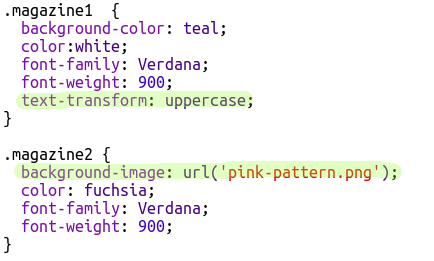

## Editando clases

+ Presiona la pestaña **'style.css'**. Encuentra el estilo para la clase CSS `newspaper` que has estado usando.

+ Observa que hay un punto (punto final) '.' antes del nombre de la clase en el archivo CSS pero no en la etiqueta `` en tu documento HTML.

+ Ahora observa las otras clases CSS que usaste para darle estilo a tu carta misteriosa. Puedes notar que:
    
    + El estilo `magazine1` cambia el texto para que todas las letras sean mayúsculas.
    
    + El estilo `magazine2` coloca una imagen detrás del texto.

+ ¿Qué pasa si cambias la etiqueta `background-image` en `magazine2` por `canvas.png`? Si prefieres `pink-pattern.png`, lo puedes cambiar. 

También puedes cambiar los colores en los estilos "magazine" si así lo deseas.

+ Busca el CSS utilizado para rotar e inclinar tus palabras:

Intenta cambiar los números para crear diferentes efectos y después verifica tu página.