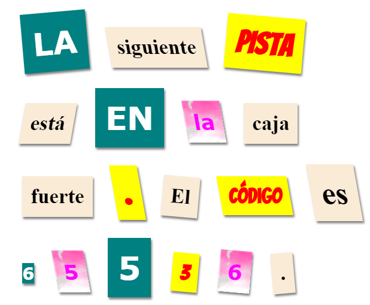

## Crea una Nueva Clase

Vamos a crear un estilo que parezca que fue cortado de un Cómic. <a href="http://jumpto.cc/web-fonts" target="_blank">jumpto.cc/web-fonts</a> contiene muchas fuentes que se pueden usar de manera gratuita.

+ Agrega una clase `comic` en el archivo **style.css**. Un buen lugar es después de `magazine2`. No olvides el punto en frente del nombre de la clase. 

No te preocupes si aparece una advertencia diciendo 'The Rule is empty'; lo arreglarás después.

+ Ahora agrega CSS a la clase CSS comic. Puedes usar diferentes colores si así lo deseas. Hay una lista de muchos colores en <a href="http://jumpto.cc/colours" target="_blank">jumpto.cc/colours</a>.

+ Usa el estilo comic en en algunas de las etiquetas `` en tu documento HTML y prueba tu página:

+ Ahora puedes agregar un tipo de letra divertido. Abre una nueva pestaña o ventana en tu navegador. Ve a <a href="http://jumpto.cc/web-fonts" target="_blank">jumpto.cc/web-fonts</a>, busca **'bangers'** y selecciónalo:

+ Haz clic en el botón + "Select this style":

Aparecerá una barra a un costado de la pantalla con el título "Selected Family".

+ Ve a la pestaña "Embed" y presiona el botón que dice "link". Copia el código que aparece debajo:

+ Pega el código `<link>` que copiaste de la página de Google dentro del `<head>` de tu página web:

Esto te permite usar el tipo de letra Bangers en tu página web.

+ Regresa a la página de tipos de letra de Google y copia el código font-family que está debajo de la leyenda "CSS rules to specify families":

+ Ahora regresa al archivo **'style.css'** en el trinket y pega el código de font-family en la clase de estilo comic:

+ Prueba tu página. El resultado debería ser como este: 

