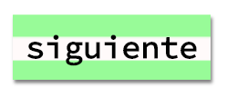

--- challenge ---

## Reto: crea un estilo de impresión de computadora

Crea un estilo antiguo de impresión de computadora y aplícalo a algunas de las palabras:

Necesitarás:

+ La familia de fuentes `VT323` de <a href="http://jumpto.cc/web-fonts" target="_blank">jumpto.cc/web-fonts</a>. Revisa de nuevo el paso 5 si necesitas un recordatorio de cómo usar los tipos de letra de Google.

+ La imagen de fondo `computer-printout-paper.png`. Revisa de nuevo el paso 4 si necesitas un recordatorio de cómo usar las imagenes de fondo.

--- /challenge ---