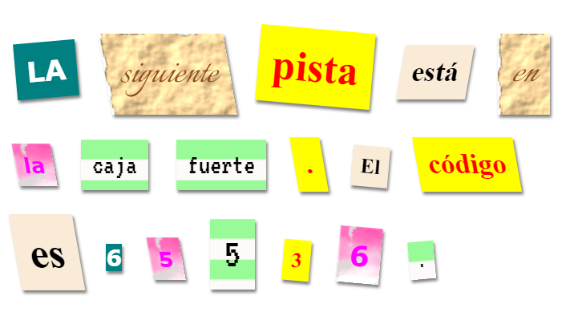

\--- challenge \---

## Reto: Crea tus Propios Estilos

Ahora crea tus propias clases de estilo y haz tu carta misteriosa aún más interesante. Usa CSS como aprendiste en los proyectos anteriores y observa los ejemplos en **styles.css** para ideas.

Aquí hay un ejemplo:

Puedes ver las imágenes que están disponibles para usar presionando la pestaña Imágenes en trinket. Intenta colocar fondos de imagen usando una de las imágenes incluidas:

+ `rough-paper.png`

+ `canvas.png`

Si tienes una cuenta de trinket, puedes subir tus propias imágenes como lo hiciste en el proyecto "Cuenta una Historia".

Encuentra tipos de letra que te gusten en <a href="http://jumpto.cc/web-fonts" target="_blank">jumpto.cc/web-fonts</a> y copia su `<link>` y código CSS en tu trinket para usarlos.

\--- /challenge \---