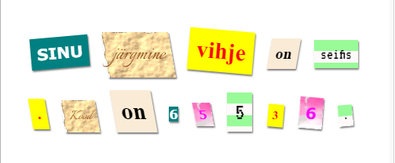

## Sissejuhatus

Selles projektis lood salakirja, mis näeb välja, justkui oleks iga sõna erinevast ajalehest, ajakirjast, koomiksist või muust allikast välja lõigatud.

### Lisainfo ringijuhendajatele

Kui sul on vaja see projekt välja printida, siis kasuta [printerisõbralikku versiooni](https://projects.raspberrypi.org/en/projects/mystery-letter/print).

## \--- collapse \---

## title: Ringijuhendaja märkmed

## Sissejuhatus:

Selles projektis tutvustatakse lastele CSS-klasse. Teksti kujundamiseks kasutavad nad mitut CSS-klassi, ühtlasi õpivad nad oma projektides taustapilte ja tasuta Google'i fonte kasutama.

## Internetiressursid

HTML-i & CSS-i kirjutamiseks soovitame kasutada [trinketit](https://trinket.io/). See projekt sisaldab järgmist trinketit:

* ["Salakirja" lähtekoht - jumpto.cc/web-letter](http://jumpto.cc/web-letter)

Lapsed võivad kasutada ka seda tühja trinketit [(jumpto.cc/html- blank)](http://jumpto.cc/html-blank) oma HTML-i & CSS-i kirjutamiseks või alternatiivina saavad nad kasutada seda näidistrinketit [(jumpto.cc/html-memplate)](http://jumpto.cc/html-template).

Leidub ka trinket, mis sisaldab näidislahendust väljakutsetele:

* ["Valmis salakiri" - trinket.io/html/1d4d4c5ce1](https://trinket.io/html/1d4d4c5ce1)

## Võrguvälised ressursid

This project can be [completed offline](https://rpf.io/html-offline) if preferred. Saad ligipääsu projekti ressurssidele, klõpsates selle projekti "Projekti materjalide" lingil. See link sisaldab jaotist "Projekti ressursid", mis sisaldab ressursse, mida lapsed selle projekti võrguühenduseta lõpetamiseks vajavad. Veenduge, et igal lapsel on juurdepääs nende ressursside koopiale. See jaotis sisaldab järgmisi faile:

* mystery-letter/index.html
* mystery-letter/style.css
* mystery-letter/script.js
* mystery-letter/prefixfree.js
* mystery-letter/4 x .png pildid
* template/template.html
* template/style.css

Selle projekti väljakutsete lõpetatud versiooni leiate ka jaotisest "Vabatahtlikud ressursid", mis sisaldab järgmist:

* mystery-letter-finished/index.html
* mystery-letter-finished/style.css
* mystery-letter-finished/script.js
* mystery-letter-finished/prefixfree.js
* mystery-letter-finished/4 x .png pildid

(Kõik ülaltoodud ressursid on samuti alla laaditavad projekti ja vabatahtliku `.zip` failina.)

## Õpieesmärgid

* See projekt tutvustab CSS-klasse ja võimalust HTML-elementide kujundamiseks mitmete klassidega.
* Tutvustatakse ka taustapilte ja Google'i fonte. 

Selles projektis käsitletakse elemente [Raspberry Pi digitaalse tegemise õppekava](http://rpf.io/curriculum) järgmistest valdkondadest:

* [Disaini põhilisi 2D- ja 3D-varasid](https://www.raspberrypi.org/curriculum/design/creator).

## Väljakutsed

* "Kujunda oma sõnumit" - Rakenda pakutavaid CSS-klassi stiile;
* "Arvuti väljatrüki stiili loomine" - Kasuta CSS-i, et taustapilti ja Google'i fonti kasutades taasluua näidisklass. 
* "Loo oma stiilid" - Kasuta CSS-i uute stiilide loomiseks.

\--- /collapse \---

## \--- collapse \---

## title: Projekti materjalid

## Projekti ressursid

* [.zip-fail, mis sisaldab kõiki projekti ressursse](https://rpf.io/p/en/mystery-letter-go)
* [Trinket veebis, mis sisaldab kõiki projekti "Salakiri" ressursse](http://jumpto.cc/web-letter)
* [Veebi-trinketi näidis](http://jumpto.cc/trinket-template)
* [Tühi trinket veebis](http://jumpto.cc/trinket-blank)
* [template/index.html](resources/template-index.html)
* [template/style.css](resources/template-style.css)
* [mystery-letter/index.html](resources/mystery-letter-index.html)
* [mystery-letter/style.css](resources/mystery-letter-style.css)
* [mystery-letter/prefixfree.js](resources/mystery-letter-prefixfree.js)
* [mystery-letter/rough-paper.png](resources/mystery-letter-rough-paper.png)
* [mystery-letter/canvas.png](resources/mystery-letter-canvas.png)
* [mystery-letter/pink-pattern.png](resources/mystery-letter-pink-pattern.png)
* [mystery-letter/computer-printout-paper.png](resources/mystery-letter-computer-printout-paper.png)

## Ringijuhendaja ressursid

* [.zip-fail, mis sisaldab kõiki lõpetatud projekti ressursse](https://rpf.io/p/en/mystery-letter-go)
* [Lõpetatud Trinketi projekt veebis](https://trinket.io/html/1d4d4c5ce1)
* [mystery-letter-finished/index.html](resources/mystery-letter-finished-index.html)
* [mystery-letter-finished/style.css](resources/mystery-letter-finished-style.css)
* [mystery-letter-finished/prefixfree.js](resources/mystery-letter-finished-prefixfree.js)
* [mystery-letter-finished/rough-paper.png](resources/mystery-letter-finished-rough-paper.png)
* [mystery-letter-finished/canvas.png](resources/mystery-letter-finished-canvas.png)
* [mystery-letter-finished/pink-pattern.png](resources/mystery-letter-finished-pink-pattern.png)
* [mystery-letter-finished/computer-printout-paper.png](resources/mystery-letter-finished-computer-printout-paper.png)

\--- /collapse \---