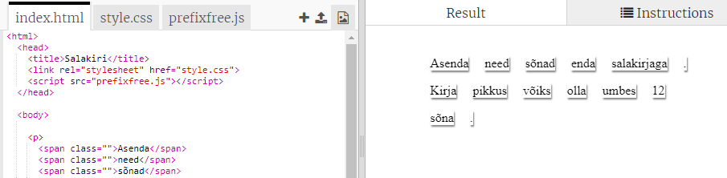
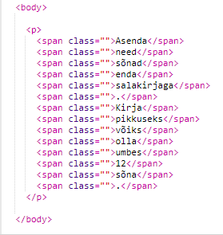
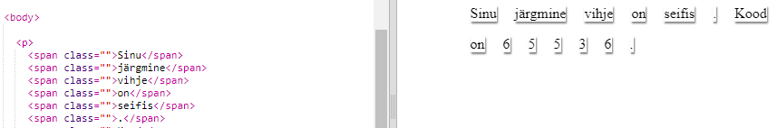

## Teie sõnumi redigeerimine

Anname sõnumi veebisaidile.

+ Avage see nipsust: <a href="http://jumpto.cc/web-letter" target="_blank">jumpto.cc/web-letter</a>.
    
    Projekt peaks olema selline:
    
    

+ Paragrahvi `
` tag lisatakse "Palju õnne sünnipäevast". Sildi `` kasutatakse rida väiksemate tekstiosade rühmitamiseks, et saaksime neid stiilida.

+ Muuda sõnumeid oma sõnumile, asetades ühe sõna igas ``. Kui teie sõnum on teistsuguse pikkusega, peate lisama või eemaldama `` sildi. 

+ Klõpsake nupul Käivita, et proovida oma nipsutit.
    
    Kui vaatate sõnu, näete, et need on stiilis kujundatud, et nad näeksid välja, et nad on lehele kinni jäänud.