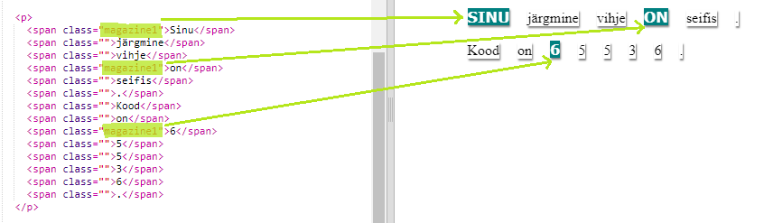
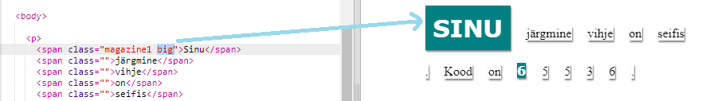

## Klassistiilide kasutamine

+ Kas märkasid `class =""` `` siltides? Saad seda kasutada rohkem kui ühe asja kujundamiseks samal viisil.

+ Anna `magazine1` klass mõnele oma `` sildile ja testi oma veebilehte.

+ Elemendile saab anda rohkem kui ühe klassi. Lihtsalt jäta ruumi vahele. Anna `suur` klass ühele oma `` siltidest. Testi oma lehte. 

