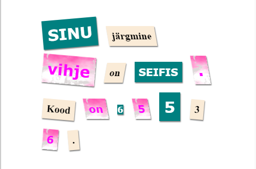

--- challenge ---

## Väljakutse: kujunda oma sõnumit

Kasuta pakutavaid stiile, et su sõnumile salakirja ilme anda.

Anna need klassid oma `` siltidele:

+ `newspaper`, `magazine1`, `magazine2`

+ `medium`, `big`, `reallybig`

+ `rotateleft`, `rotateright`

+ `skewleft`, `skewright`

Ära anna igast reast rohkem kui ühte kindlale ``-ile.

Sinu kiri võiks välja näha selline:

--- /challenge ---