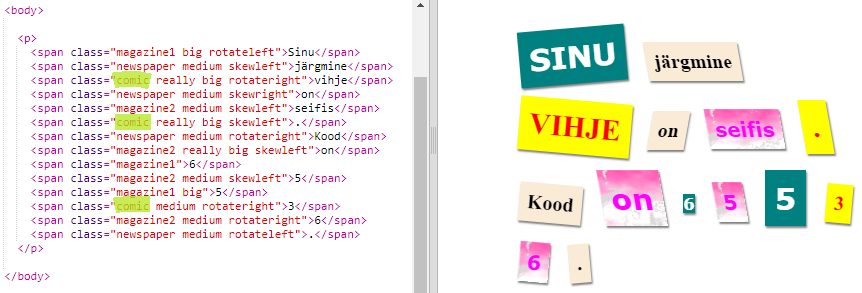
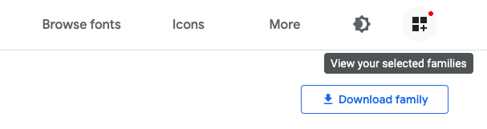
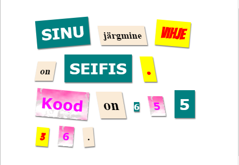

## Loo uus klass

Loome stiili, mis näib olevat välja jäetud Comicist. <a href="http://jumpto.cc/web-fonts" target="_blank">jumpto.cc/web-fonts</a> pakub hulgaliselt fonte, mida on vabalt kasutada.

+ Lisage `koomiline` klass **faili style.css**. Pärast `ajakirja2` on hea koht. Ärge unustage klassi nime ees olevat punkti. 

Ärge muretsege, kui saate hoiatuse, mis ütleb, et reegel on tühi; siis muudad seda järgmisena.

+ Nüüd lisage CSS-i koomiksisse CSS-klassi. Võite kasutada erinevaid värve, kui soovite. Siin on nimekiri värve <a href="http://jumpto.cc/colours" target="_blank">jumpto.cc/colours</a>.

+ Kasutage HTML-dokumendis mõnede `` märgiste koomilist stiili ja katsetage oma lehte:

+ Nüüd saate lisada lõbusat fonti. Avage uus brauseri sakk või aken. Minge <a href="http://jumpto.cc/web-fonts" target="_blank">jumpto.cc/web-fonts</a> ja otsige **'nurgaid'**:

+ Klõpsake nupul + "Vali see font":

Ekraani allosas kuvatakse sõnum "1 valitud perekond".

+ Akna avamiseks klõpsake "1 perekonna valitud" sõnumit ja kopeerige esile tõstetud kood:

+ Kleepige koodi `<link>` , mille olete lihtsalt Google'i fontidelt oma veebisaidile `<head>` kopeerinud:

See võimaldab teil oma veebilehel kasutada Bangersi fonti.

+ Tagasi Google'i fontide juurde ja sirvige lehel allapoole ja kopeerige font-perekonna kood:

+ Nüüd pöörduge tagasi oma faili **'style.css'** faili juurde ja kleepige font-perekonna kood koomiksisse stiilis:

+ Proovige oma veebilehte. Tulemuseks peaks olema selline näide: 

