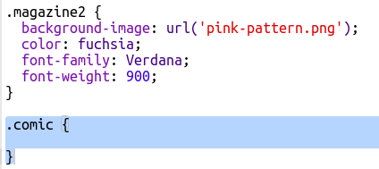
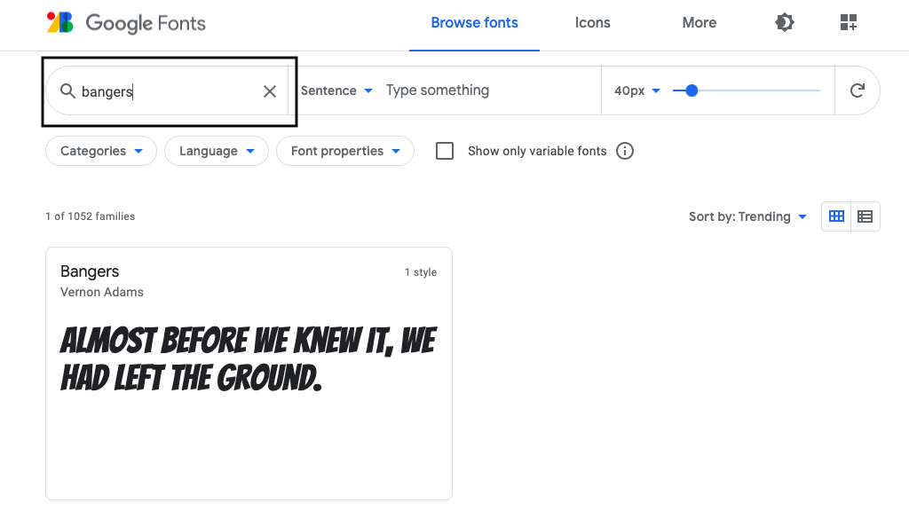
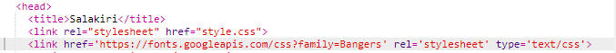

## Loo uus klass

Loome stiili, mis näib olevat koomiksist välja lõigatud. <a href="http://jumpto.cc/web-fonts" target="_blank">jumpto.cc/web-fonts</a> pakub hulgaliselt fonte, mis on vabas kasutuses.

+ Anna `comic` klass **style.css** failile. Pärast klassi `magazine2` on hea koht. Ära unusta klassi nime ees olevat punkti. 

Ära muretse, kui saad hoiatuse, mis ütleb, et "Reegel on tühi"; selle parandad järgmisena.

+ Nüüd lisa natuke CSS-i koomiksi CSS-klassi. Võid soovi korral kasutada erinevaid värve. Värvide nimekirja leiad: <a href="http://jumpto.cc/colours" target="_blank">jumpto.cc/colours</a>.

+ Kasuta HTML-dokumendis mõnede `` siltide puhul koomiksistiili ja testi oma lehte:

+ Nüüd saad lisada lõbusa fondi. Ava uus brauseri vahekaart või aken. Mine <a href="http://jumpto.cc/web-fonts" target="_blank">jumpto.cc/web-fonts</a> ja otsi **'bangers'**:

+ Click on the font preview box then click on '+ Select this style':

View your selected fonts by clicking on the 'View your selected families' icon in the top right menu bar:

+ Go to the 'Use on the web' section, copy the text from the <link />
    box:

+ Kleebi `<link>` kood, mille sa just Google'i fontidest oma veebilehe `<head>` kopeerisid:

See võimaldab sul oma veebilehel kasutada Bangersi fonti.

+ Return to Google fonts and scroll further down to copy the CSS font-family code:

+ Nüüd mine tagasi oma **'style.css'** faili juurde trinketis ja kleebi fondiperekonna kood koomiksistiili:

+ Testi oma veebilehte. Tulemus peaks välja nägema umbes selline: 

